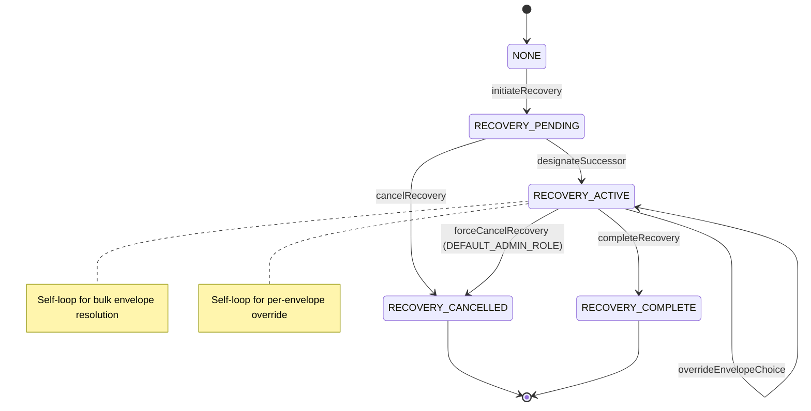
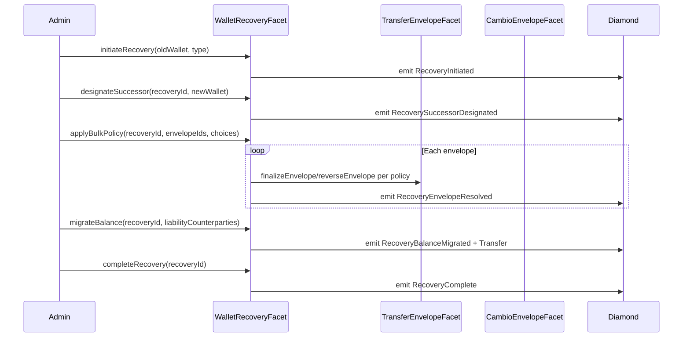
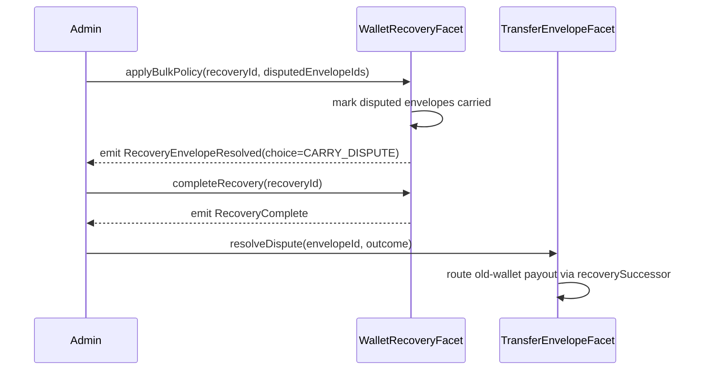
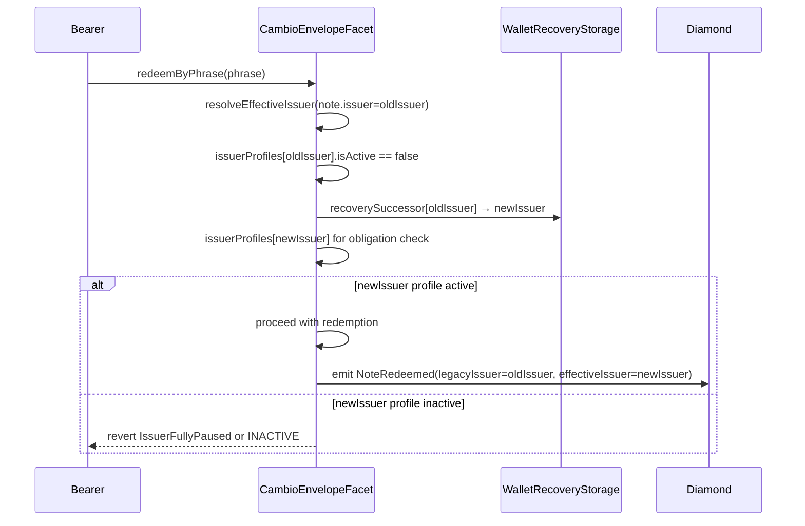

# FR-1402: Wallet Recovery Redesign — Design Specification (Draft)

**Date:** 2026-05-07  
**Branch:** `feature/envelope-besu`  
**Status:** ROUND 5 REVIEW COMMENTS INCORPORATED 2026-05-21  
**Author:** AI Agent  
**Reviewers:** Jesse  
**Review Date:** 2026-05-21

---

## 1. Problem Statement

In the T3 Besu permissioned consortium, member banks are represented by Ethereum addresses that hold ERC-20 balances (T3USD), participate in transfer envelopes, issue Cambio bearer notes, and maintain custodial relationships with end-user wallets. When a bank loses control of its operational wallet — whether through lost keys, compromised keys, or orderly exit from the consortium — all on-chain state associated with that address must be resolved and migrated in a controlled, auditable manner.

Unlike the Avalanche-era design, the Besu model has **no epochs, no masked balances, and no cryptographic privacy layer**. Recovery is therefore simpler in some dimensions (no zero-knowledge state to reconstruct) but more complex in others because every envelope holds **real token escrow in `address(this)`**, every Cambio note represents a **live issuer obligation backed by escrowed T3USD**, and every wallet has **live ViewACL and CustodianRegistry relationships** that gate read access for the entire consortium.

The stakes of wallet recovery include:

- **Token escrow in open envelopes**: Funds held in the diamond contract for envelopes in `EnvelopeState.Created`, `EnvelopeState.Disputed`, or `EnvelopeState.PendingFiatConfirmation` must not be stranded or stolen.
- **Pending fiat settlements**: `FIAT_INSTITUTIONAL` envelopes in provisional settlement may be mid-wire; recovery must not create double-spend or clawback ambiguities.
- **Active disputes**: Envelopes in `EnvelopeState.Disputed` have a resolver authority model that may be tied to the recovering wallet.
- **Outstanding Cambio notes**: Issuer obligations (`IssuerEnvelopeProfile.valueOutstanding > 0`) represent bearer claims against the issuer. If the issuer enters recovery, redemption must either be honored by a replacement wallet or explicitly revoked with escrow returned.
- **Custodian registry relationships**: `_custodyInfo[wallet]` maps wallets to custodian banks and KYC timestamps. Recovery must transfer or re-register these.
- **ViewACL entries**: `ViewACLLib.requireWalletAccess()` and `requireEnvelopeAccess()` depend on custodian relationships. A recovering wallet's custodian must retain (or transfer) visibility into the old wallet's state during resolution.

> **⚠️ HISTORICAL SPEC — the state described below has been superseded.** This document was
> written 2026-05-07, when `WalletRecoveryFacet` was a stub. It is retained as the design record
> for the work that followed. **The facet is now fully implemented** — `initiateRecovery`,
> `designateSuccessor`, `applyBulkPolicy`, `completeRecovery` and `cancelRecovery` all have real
> bodies. Read the source, not this section, for current behaviour.

As of this spec's authorship, `WalletRecoveryFacet.sol` (`contracts/facets/WalletRecoveryFacet.sol`) was a stub that defined:

- `initiateRecovery(address wallet, uint8 recoveryType) external pure returns (bytes32)`
- `electEnvelopeOutcome(bytes32 recoveryId, bytes32 envelopeId, uint8 choice) external pure`
- `getRecovery(bytes32 recoveryId) external pure returns (address, uint8, uint8, uint40)`

Its NatSpec describes an 8-state machine (`NORMAL → RECOVERY_REQUESTED → INDEX_VERIFYING → AWAITING_AUTHORIZATION → RESOLVING_ENVELOPES → MIGRATING_BALANCE → QUARANTINE → COMPLETE`). This spec re-evaluates that machine for the Besu envelope model and proposes a simplified replacement.

**Critical constraint**: `WalletRecoveryFacet` has never been deployed to a live blockchain. There is **no on-chain state to migrate** — we are designing from a clean slate.

---

## 2. Recovery Scenarios

| Scenario | In Scope? | Notes |
|---|---|---|
| **Lost key** (bank loses signing key) | **Yes** | Primary scenario. Bank cannot sign transactions; admin must force recovery after verification. |
| **Compromised key** (key known to be stolen) | **Yes** | Urgency is higher; admin-initiated with immediate freeze. Election window may be shortened or skipped. |
| **Bank exit from consortium** | **Yes** | Orderly exit. Envelopes should be reversed or finalized; Cambio notes cancelled or transferred; balance migrated to a settlement address. |
| **Bank merger / key rotation** | **Yes** | Planned migration. Self-initiated path (if allowed) with cooperative counterparty elections. Old and new wallets may both be consortium members. |
| **T3 operator wallet compromise** | **Partial** | Different roles involved (`ADMIN_ROLE`, `DEFAULT_ADMIN_ROLE`). Operator recovery is a governance emergency, not a wallet-recovery facet concern. The facet handles **member banks** (`CUSTODIAN_ROLE`, `CAMBIO_ISSUER_ROLE`). Out of scope for FR-1402; flag for governance playbooks. |
| **End-user wallet recovery** | **No** | End users are custodied wallets registered via `CustodianRegistryFacet.registerCustodiedWallet()`. Their recovery is a custodian operational process (re-register KYC, rotate address). The envelope/Cambio state is owned by the **bank**, not the end user. |
| **SmartLock fragment loss** | **No** | SmartLock envelope recovery is handled by `releaseAuthorizedAddress` (a custodian with `CUSTODIAN_ROLE`). If that custodian is the recovering bank, this falls under normal envelope recovery. |

---

## 3. Open Envelope Handling

The envelope lifecycle is defined in `contracts/lib/EnvelopeStorage.sol`. The `EnvelopeState` enum values are:

- `None` (0) — non-existent
- `Created` (1) — envelope open, funds escrowed, commit window active or expired
- `Finalized` (2) — terminal, funds released
- `Reversed` (3) — terminal, funds returned
- `Disputed` (4) — dispute active, finalization and reversal blocked
- `Expired` (5) — terminal, auto-processed by expiration behavior
- `PendingFiatConfirmation` (6) — provisional fiat settlement, clawback window open

> **Mapping note**: The prompt's conceptual "ACTIVE" maps to `EnvelopeState.Created`; "DISPUTE_HOLD" maps to `EnvelopeState.Disputed`; "PENDING_FIAT_CONFIRMATION" maps to `EnvelopeState.PendingFiatConfirmation`. There is no distinct "PENDING" state in `EnvelopeStorage` — an envelope is either `Created` (open) or terminal. The table below uses the actual Solidity enum names.
>
> **Important disambiguation**: `EnvelopeStorage` defines two separate enums. `EnvelopeState` (the lifecycle state of an envelope — `Created`, `Disputed`, etc.) is distinct from `ExpirationBehavior` (how an envelope behaves at its commit-window boundary — `HALFLIFE_DECAY`, `HOLD_UNTIL_MANUAL`, `ORACLE_CONDITIONAL`, `AUTO_REVERSE`, and also `DISPUTE_HOLD` at ordinal 5). An envelope in `EnvelopeState.Disputed` reached that state because a party called `raiseDispute()`; `ExpirationBehavior.DISPUTE_HOLD` is a creation-time setting that freezes the envelope at expiry. Both result in a frozen envelope but via different paths. The table below uses `EnvelopeState` values only.

For each open (non-terminal) state, the behavior when **sender** or **recipient** enters recovery:

| Envelope State | Sender in Recovery | Recipient in Recovery |
|---|---|---|
| **`Created`** (open, escrowed) | Admin may elect to **reverse** (return to sender, then migrate balance) or **finalize** (if sender's obligation should be honored despite key loss, e.g., merger). Default: **reverse** (safe — returns funds to sender's balance, then migrates with rest of balance). | Admin may elect to **finalize** (release to recipient) or **reverse** (if recipient cannot receive). Default: **finalize** (recipient is a member bank that should receive what was owed). |
| **`Disputed`** (frozen) | Recovery may complete while the dispute remains open. The disputed envelope stays keyed to the historical sender, but any eventual sender-side payout is redirected through `recoverySuccessor[oldWallet]`. The dispute belongs to the bank entity, not the lost key. | Same logic inverted. Any eventual recipient-side payout is redirected through `recoverySuccessor[oldWallet]`. Dispute investigation and legal hold timelines do not block wallet replacement. |
| **`PendingFiatConfirmation`** (provisional) | Admin must decide: **clawback** (reverses to sender, then migrates) or **confirm fiat delivery** (burns escrow, finalizes). If fiat wire is uncertain, clawback is the safe default. If delivery is confirmed off-chain, confirm. | Recipient in recovery does not change the provisional state materially — the envelope was already released to recipient's balance provisionally. Admin should confirm or clawback based on fiat wire status, then migrate the recipient's final balance. |
| **`Finalized` / `Reversed` / `Expired`** (terminal) | No envelope-level action. Terminal envelopes are historical. Any residual balance effect is already in the wallet's ERC-20 balance and will be handled by balance migration. | Same as sender. |

### Special Cases

- **`HALFLIFE_DECAY`**: If sender is in recovery and envelope is `Created` past `commitWindowEnd`, the reversible amount has decayed to zero. The only safe election is **finalize**.
- **`HOLD_UNTIL_MANUAL`**: These envelopes (including SmartLock envelopes) require admin/arbiter to finalize or reverse anyway. Recovery adds no new authority — the admin simply acts through the recovery flow.
- **`ORACLE_CONDITIONAL`**: If oracle callback has not been received, the safe default is **reverse** (same as `processExpiration` timeout behavior). If callback was received with `result = true`, election must be **finalize**.
- **`AUTO_REVERSE` past `commitWindowEnd`**: The envelope should have already auto-reversed to `Reversed`. If it hasn't been keeper-triggered, the recovery process may call `processExpiration()` as a cleanup step before balance migration.

---

### Bulk-Resolve Algorithm

- **Input**: Admin supplies `bytes32[] envelopeIds` explicitly — the facet does NOT iterate `senderEnvelopeIds[oldWallet]` or `recipientEnvelopeIds[oldWallet]` on-chain because these are unbounded arrays and iteration is an O(n) anti-pattern in Solidity. The Ponder indexer builds the list of open envelope IDs offline and passes it to the relayer, which calls `applyBulkPolicy` in paginated batches.
- **Batch size**: Recommend a caller-supplied array with a maximum enforced on-chain (e.g., `require(envelopeIds.length <= 50, "BatchTooLarge")`). Admin calls multiple transactions for large banks.
- **Idempotency and Event Emission**: Before processing each envelope, check `recoveries[recoveryId].resolvedEnvelopes[envelopeId] == true`. If already resolved, skip the state updates but still emit the corresponding `RecoveryEnvelopeResolved` event (with `amountMoved = 0` and the selected choice) so off-chain indexers receive a consistent, complete event stream and can distinguish "success" from "already done". The same idempotency and event emission rules apply to Cambio note resolution: if `recoveries[recoveryId].resolvedNotes[noteId] == true`, skip updating but emit `RecoveryCambioNoteResolved`.
- **Disputed envelopes**: Do not block `completeRecovery`. If an envelope is already `EnvelopeState.Disputed`, mark it as carried by emitting `RecoveryEnvelopeResolved(..., choice = CARRY_DISPUTE, amountMoved = 0)` and set `resolvedEnvelopes[envelopeId] = true`. Later dispute resolution must route any old-wallet payout through `recoverySuccessor[oldWallet]`.
- **Policy override before bulk**: Admin may call `overrideEnvelopeChoice(recoveryId, envelopeId, choice)` for any individual envelope BEFORE calling `applyBulkPolicy`. The override is stored in `recoveries[id].envelopeOverrides[envelopeId]` using a one-based encoding (`0 = no override`, `stored = choice + 1`) so `FINALIZE = 0` remains representable. During `applyBulkPolicy`, the override takes precedence over the default `RecoveryPolicy`.
- **Gas estimate**: At ~5,000 gas per envelope election (state write + event), a 50-envelope batch costs ~250,000 gas. A 1,200-envelope bank requires ~24 transactions. Admin tools should pre-compute the batch sequence.

### Envelope Recovery Choice Encoding

Use one enum consistently across policy defaults, overrides, and events:

```solidity
enum EnvelopeRecoveryChoice {
    Finalize,      // 0
    Reverse,       // 1
    Clawback,      // 2
    ConfirmFiat,   // 3
    CarryDispute   // 4
}
```

`RecoveryPolicy` fields store the enum value directly. `envelopeOverrides[envelopeId]` uses one-based storage only so the mapping default can mean "no override":

```solidity
// 0 = no override; use RecoveryRecord.policy
// 1 = Finalize
// 2 = Reverse
// 3 = Clawback
// 4 = ConfirmFiat
// 5 = CarryDispute
```

When applying a policy, convert overrides explicitly:

```solidity
uint8 storedOverride = recoveries[recoveryId].envelopeOverrides[envelopeId];
EnvelopeRecoveryChoice choice = storedOverride == 0
    ? _defaultChoiceForEnvelope(recoveries[recoveryId].policy, envelopeId)
    : EnvelopeRecoveryChoice(storedOverride - 1);
```

Do not use a separate `0 = carry dispute` / `1 = admin resolve` encoding inside `RecoveryPolicy`. If a future design needs a "manual review required" outcome, add a new enum value such as `ManualReview = 5` and document its runtime behavior.

---

## 4. Open Cambio Note Handling

Cambio envelope-mode notes are stored in `CambioEnvelopeStorage.layout().envelopeNotes[noteId]` (`CambioEnvelopeNote` struct). Issuer state is tracked per-wallet in `issuerProfiles[issuer]` (`IssuerEnvelopeProfile` struct) with fields: `sponsorBank`, `isActive`, `openRedemption`, `notesOutstanding`, `valueOutstanding`, `t3usdEscrowed`, `t3usdRedeemed`, `t3usdCancelled`, `dailyRedemptionCeiling`, `pauseState`, etc.

### 4.1 Issuer Wallet in Recovery with Outstanding Notes (`valueOutstanding > 0`)

The issuer has escrowed T3USD in the diamond (`t3usdEscrowed`) and has live bearer obligations.

**Options:**
1. **Transfer issuer profile to replacement wallet**: The new wallet assumes all `IssuerEnvelopeProfile` counters, `valueOutstanding`, `notesOutstanding`, and the obligation to honor redemptions. Existing notes remain valid; their `note.issuer` field stays the old address (this is immutable historical data), but the **profile** moves to the new address. New notes can be issued from the new wallet after recovery completes.
2. **Freeze new issuance, allow existing notes to run to expiry**: Old wallet's `issuerProfiles` entry is marked inactive (`isActive = false`, `pauseState = FULLY_PAUSED`). Existing notes can still be redeemed until `deadline`; unredeemed notes after deadline auto-expire (the issuer self-recovery path in `redeemByNoteId` already allows issuer to reclaim post-deadline). Remaining escrow is returned to the old wallet's balance and then migrated.
3. **Revoke all outstanding notes immediately**: Force-cancel every open note, return all escrow to old wallet's balance, then migrate. This is the nuclear option — simplest, but may strand legitimate bearers.

> **Key structural constraint**: `CambioEnvelopeNote.issuer` is immutable. If we transfer the profile, the note struct itself still references the old address. Redemption functions (`redeemByPhrase`, `redeemByNoteId`) currently look up `note.issuer` through `issuerEffectiveState(note.issuer)`. `ICambioIssuer.issuerEffectiveState(address)` currently returns only `CambioEnvelopeStorage.PauseState`, so FR-1402 must not silently change that return type. We must either:
> - Update `note.issuer` (struct mutation — possible but loses audit trail), or
> - Maintain a forwarding mapping `recoverySuccessor[oldIssuer] = newIssuer` that a new `resolveEffectiveIssuer` helper consults, or
> - Keep the old profile active but transfer control to the new wallet.

### 4.2 Issuer in Recovery with Notes in Mid-Redemption (Commit Revealed, Not Yet Executed)

The commit-reveal system (`commitRedemption` / `revealRedemption`) stores `CommitRecord` in `CambioEnvelopeStorage.layout().commitments[commitmentHash]`. A commit binds `noteId`, `phrase`, `redeemer`, `amount`, `nonce`.

- If the **issuer** enters recovery: The commitment is independent of issuer state. The redeemer can still call `revealRedemption()` if the note is active and the issuer is not `FULLY_PAUSED`. If we pause the issuer, `revealRedemption` reverts with `IssuerFullyPaused`.
- If the **redeemer** enters recovery: The `CommitRecord.redeemer` is the old wallet address. The reveal requires `msg.sender` (or ERC-2771 extracted sender) to match `commit.redeemer`. If the redeemer's wallet is recovered to a new address, the old address cannot sign, so the commit is stranded unless the admin can either:
  - Transfer the commit to the new address (not currently supported), or
  - Cancel the commit via `cancelCommit` (only the committer can do this — old wallet can't sign), or
  - Let it expire and be cleared by `clearExpiredCommit` (anyone can call after expiry).

> **Recommendation (DRAFT)**: Commits are ephemeral (max lifetime `config.maxCommitLifetime`, default likely hours). For recovery, do not special-case commits. If the redeemer's wallet is recovered, they lose any non-revealed commits and must re-commit from the new wallet. This is acceptable because commit-reveal is a high-value path with short expiry.

### 4.3 Bearer Note Holder (Redeemer) Wallet in Recovery

A redeemer is typically an end user or a counterparty bank presenting a phrase or note ID. If the **redeemer** loses their key:

- For `redeemByPhrase`: The phrase is the secret. Anyone with the phrase can redeem to **any** address (the redeemer address is supplied at reveal time, not bound at creation). Actually, in `redeemByPhrase`, `redeemer = _msgSenderCambio()` — the redeemer is the caller. If the caller's wallet is recovered, they simply use the new wallet to call `redeemByPhrase`. The old wallet address is irrelevant.
- For `redeemByNoteId`: Role-gated. If the redeemer held `CAMBIO_REDEEMER_ROLE` on the old wallet, the role must be granted to the new wallet.
- For `revealRedemption`: The commit binds `redeemer` address. If the redeemer wallet changes, the commit is invalid (see 4.2).

> **Conclusion**: Bearer note holder recovery is **not a primary recovery concern** for FR-1402. The bearer nature of Cambio notes means the secret (phrase) is what matters, not the wallet identity, except for role-gated and commit-reveal paths.

### 4.4 Cambio Issuer Forwarding Mechanics

- **Storage**: `recoverySuccessor[oldIssuer] = newIssuer` in `WalletRecoveryStorage.Layout`. Set at `designateSuccessor` time if old wallet has `issuerProfiles[oldWallet].notesOutstanding > 0`. Not set if the issuer has no outstanding notes.

- **Read path**: add a new helper instead of changing `issuerEffectiveState(address)`:
  ```
  function resolveEffectiveIssuer(address issuer) internal view returns (address effectiveIssuer, bool active) {
      address successor = issuer;
      for (uint256 i = 0; i < 3; i++) {
          address next = WalletRecoveryStorage.layout().recoverySuccessor[successor];
          if (next == address(0) || next == successor) break; // Bounded loop to support chained recovery (A -> B -> C)
          successor = next;
      }
      IssuerEnvelopeProfile storage profile = CambioEnvelopeStorage.layout().issuerProfiles[successor];
      return (successor, profile.isActive);
  }
  ```
  `CambioIssuerFacet.issuerEffectiveState(address)` should keep its existing ABI and may internally call the helper when it only needs the effective pause state. Redemption paths that need liability attribution should call `resolveEffectiveIssuer`.

- **Loop prevention**: Bounded successor lookup loop capped at a maximum depth of 3 to safely traverse chained recoveries (e.g., `A -> B -> C`) without cycle/revert risks.

- **Chain Compaction on Completion**: When `completeRecovery` runs for Bank B→C, the admin can pass a list of predecessor addresses (e.g., Bank A) whose successor is currently Bank B. The contract updates their `recoverySuccessor` mapping to point directly to Bank C (A→C). This flattens successor chains and keeps lookup paths O(1).

- **`note.issuer` immutability**: `CambioEnvelopeNote.issuer` is the address that created the note and is immutable (set at `createCambioNote`). It is purely historical. The redemption path uses `resolveEffectiveIssuer(note.issuer)` to resolve the current obligation holder. Events emitted at redemption should include both fields for indexer clarity:
  ```solidity
  // In NoteRedeemed event (to be added to IWalletRecoveryEvents or CambioEnvelopeStorage)
  event NoteRedeemed(
      bytes32 indexed noteId,
      address indexed legacyIssuer,   // note.issuer (immutable original)
      address indexed effectiveIssuer, // resolved via recoverySuccessor if applicable
      address redeemer,
      uint256 amount
  );
  ```
  This allows Ponder indexer to correctly attribute liability in both the old and new issuer's records.

- **Ceiling buckets transfer**: `CambioEnvelopeStorage.layout().issuerCeilingBuckets[oldIssuer]` holds rolling daily redemption limit state (`RollingCeilingBuckets` struct). At `designateSuccessor`, copy this struct to `issuerCeilingBuckets[newIssuer]` with a **timestamp reset** (zero out the rolling window so the new wallet starts fresh). Rationale: the old wallet's redemption history is not relevant for rate-limiting the new wallet's future issuance. The transfer prevents the new wallet from immediately hitting a limit on day 1.

- **Pending commits**: `CambioEnvelopeStorage.layout().commitments[commitHash]` stores `CommitRecord{noteId, phrase, redeemer, amount, nonce, expiresAt}`. Commits do NOT reference the issuer address directly — they bind `noteId` and `redeemer`. Therefore, **no commit records need to be migrated** when the issuer changes. A redeemer with a valid commit can still call `revealRedemption(commitHash)`, which will look up the note, call `resolveEffectiveIssuer(note.issuer)`, resolve to the new issuer, and proceed as normal provided the new issuer's profile is active and not paused.

### 4.5 SmartLock Envelope Recovery

`SmartLockEnvelopeFacet` (FR-1403) creates envelopes with `HOLD_UNTIL_MANUAL` expiration behavior, secured by fragment-commitment hash locks (`keccak256(fragment || nonce) == hashCommitment`). These envelopes share the same `EnvelopeStorage.EnvelopeData` lifecycle as regular transfer envelopes but have additional `SmartLockEnvelopeStorage.SmartLockCondition` state (hashCommitment, nonce, releaseAuthorizedAddress).

#### 4.5.1 Sender Wallet in Recovery

If the **sender** of a SmartLock envelope enters recovery:

- **Cancel path**: `cancelSmartLockEnvelope` requires `msg.sender == env.sender || _isAdmin(msg.sender)`. Since the old wallet cannot sign, the admin path must be used. The recovery admin can cancel the SmartLock envelope and return escrow to the old wallet's balance (which is then migrated to the new wallet).
- **Release path**: `releaseSmartLockEnvelope` does NOT require the sender's signature — anyone with the valid fragment can release. If the counterparty (or authorized releaser) knows the fragment, they can release the envelope to the recipient regardless of sender recovery state.
- **Post-recovery recipient routing**: `releaseSmartLockEnvelope` must resolve `env.recipient` through `WalletRecoveryStorage.layout().recoverySuccessor` before releasing escrow. Fragment-holder release is a legitimate counterparty action and should not be blocked by recovery, but a release after `RECOVERY_COMPLETE` must not strand funds at a decommissioned recipient wallet. If no successor exists, release to the historical recipient as today.
- **Bulk resolution**: SmartLock envelopes stored in `EnvelopeStorage.envelopes[envelopeId]` are indexed in `senderEnvelopeIds[sender]` and `recipientEnvelopeIds[recipient]`, and the indexer can include them in explicit recovery batches. However, the bulk resolver must use SmartLock cancellation semantics (not generic `reverseEnvelope`) because SmartLock envelopes have their own condition storage and events. The recovery facet must detect envelope type and dispatch to an internal helper or recovery-specific admin path rather than relying on a raw diamond self-call.

#### 4.5.2 Recipient Wallet in Recovery

If the **recipient** of a SmartLock envelope enters recovery:

- The envelope's `env.recipient` is immutable (set at creation). If released without recovery-aware payout routing, tokens go to the old recipient address. Since the old wallet is quarantined or decommissioned, those tokens can be stranded.
- **Resolution**: The recovery admin should cancel the SmartLock envelope (returning escrow to sender), then the sender can create a new SmartLock envelope to the recipient's new wallet. Alternatively, the admin can force-finalize via the envelope bulk resolver and then migrate the balance from the old recipient wallet.

#### 4.5.3 ReleaseAuthorizedAddress in Recovery

If the `releaseAuthorizedAddress` designated in the SmartLock condition enters recovery:

- The `releaseAuthorizedAddress` is checked only if `msg.sender == releaseAuthorizedAddress`, and the check requires `CUSTODIAN_ROLE`. If this address is in recovery and its `CUSTODIAN_ROLE` is being managed, any other caller with the valid fragment can still release the envelope.
- **No migration needed** for the `releaseAuthorizedAddress` — it is an authorization mechanism, not a state owner.

#### 4.5.4 SmartLock Storage During Recovery

| Mapping (Storage Library) | Action on Recovery | Rationale |
|---|---|---|
| `SmartLockEnvelopeStorage.conditions[envelopeId]` | **No migration** | Keyed by envelopeId, not wallet address. Conditions remain valid regardless of wallet recovery. |

#### 4.5.5 Quarantine Flag Integration

`SmartLockEnvelopeFacet.createSmartLockEnvelope` must check `activeRecoveryCount[msg.sender] > 0` and revert if true. This is already noted in Section 7 but listed here for completeness. The `releaseSmartLockEnvelope` and `cancelSmartLockEnvelope` functions should NOT check the quarantine flag — the admin must be able to cancel during recovery, and fragment holders must be able to release.

### 4.6 EnvelopeInheritanceFacet

> **⚠️ SUPERSEDED.** `EnvelopeInheritanceFacet` is now implemented — `createChildEnvelope`
> exists with quarantine checks, escrow handling and events. The action item at the end of this
> section has therefore come due: parent-child resolution semantics are NOT yet covered by
> FR-1402 even though the facet shipped.

At the time of writing, `EnvelopeInheritanceFacet` was a stub (all functions reverted with `NotImplemented()`). When parent-child envelope support is implemented in a future FR, the recovery spec must be updated to address: (a) whether resolving a parent envelope cascades to children, (b) whether child envelopes can be independently resolved during recovery, and (c) whether `createChildEnvelope` checks the quarantine flag.

> **Action item**: When EnvelopeInheritanceFacet ships, update FR-1402 to cover parent-child resolution semantics.

---

## 5. Proposed State Machine

The original stub proposed 8 states:

```
NORMAL → RECOVERY_REQUESTED → INDEX_VERIFYING → AWAITING_AUTHORIZATION →
RESOLVING_ENVELOPES → MIGRATING_BALANCE → QUARANTINE → COMPLETE
```

For Besu (no epochs, no masked balances, plaintext amounts), this is over-engineered. The indexer (Ponder) does not need an on-chain "INDEX_VERIFYING" phase — it watches events asynchronously. The "QUARANTINE" phase is redundant if we have a freeze mechanism.

### Proposed Simplified States

| State | Value | Description |
|---|---|---|
| `NONE` | 0 | Default / no recovery in progress. |
| `RECOVERY_PENDING` | 1 | Recovery initiated. Old wallet is frozen. Admin has `electionWindow` seconds to resolve open envelopes and designate a successor. |
| `RECOVERY_ACTIVE` | 2 | Envelopes are being resolved (bulk or per-envelope). New wallet has been designated. Old wallet remains frozen. |
| `RECOVERY_COMPLETE` | 3 | All obligations transferred or settled. Old wallet decommissioned (role revoked, custodian unregistered). Final balance migrated to new wallet. |
| `RECOVERY_CANCELLED` | 4 | Recovery was aborted before completion. Old wallet unfrozen, state reverts to normal. Only valid if no envelopes were modified. |

### Valid Transitions

```
NONE ──[initiate]──► RECOVERY_PENDING ──[designate successor + start resolve]──► RECOVERY_ACTIVE
                                                                         │
                                                                         ▼
                                                           RECOVERY_COMPLETE
                                                                         ▲
                                                                         │
RECOVERY_PENDING ──[cancel]──► RECOVERY_CANCELLED ─┘
RECOVERY_ACTIVE ──[DEFAULT_ADMIN_ROLE force-cancel]──► RECOVERY_CANCELLED
                                                              │
                                                              └──────► (back to NONE implicitly)
```

### On-Chain Timelock Enforcement

To prevent immediate completion of self-initiated recoveries without operator/compliance oversight, the `completeRecovery` function must verify the review timelock on-chain:
- For self-initiated recoveries (`recoveryType == KeyRotation`), `completeRecovery` must revert with `TimelockActive` if `block.timestamp < recoveries[recoveryId].timelockEndsAt`.
- For admin-initiated recoveries, the timelock check is bypassed, allowing immediate completion when appropriate.
```

### Cancellation Rules

| State | Who Can Cancel | Condition |
|---|---|---|
| `RECOVERY_PENDING` | `initiatedBy`, `ADMIN_ROLE`, or `DEFAULT_ADMIN_ROLE` | Allowed. For self-initiated recoveries (KeyRotation), the `initiatedBy` is `oldWallet` which is compromised. To prevent an attacker from cancelling, cancellation of self-initiated recovery is restricted strictly to `ADMIN_ROLE` or `DEFAULT_ADMIN_ROLE`. |
| `RECOVERY_ACTIVE` | `DEFAULT_ADMIN_ROLE` only | Allowed as a governance override. If `envelopesResolved > 0` or `cambioNotesResolved > 0`, cancellation is irreversible in the sense that already-settled envelope/Cambio actions are not rolled back. Emit `RecoveryCancelled(..., irreversible = true)` or a paired warning event for the indexer. |

`designateSuccessor` is not an envelope election. However, once any envelope or Cambio note is resolved, recovery cancellation becomes a super-admin incident action rather than a normal abort path. `cancelRecovery` must decrement `activeRecoveryCount[oldWallet]` exactly once for the closed recovery and must not clear `recoverySuccessor` if doing so would break carried dispute or Cambio note routing.

Both `completeRecovery` and `cancelRecovery` must be state-idempotent with respect to `activeRecoveryCount`. `completeRecovery` must require `state == RECOVERY_ACTIVE` before doing any terminal writes, then set `state = RECOVERY_COMPLETE` and decrement `activeRecoveryCount[oldWallet]` exactly once. `cancelRecovery` must require `state == RECOVERY_PENDING || state == RECOVERY_ACTIVE`, then set `state = RECOVERY_CANCELLED` and decrement exactly once. Calls against `RECOVERY_COMPLETE` or `RECOVERY_CANCELLED` must revert with `InvalidRecoveryState` so replayed transactions cannot underflow or over-decrement the reference count.

### Simplification Rationale

| Original Stub State | Simplified To | Rationale |
|---|---|---|
| `NORMAL` | `NONE` | Same meaning. |
| `RECOVERY_REQUESTED` | merged into `RECOVERY_PENDING` | No multi-phase approval gate needed on-chain; approval is an off-chain governance step. |
| `INDEX_VERIFYING` | **removed** | Ponder indexer is async; no on-chain state needed for indexing. |
| `AWAITING_AUTHORIZATION` | merged into `RECOVERY_PENDING` | Authorization happens before `initiateRecovery` is called (off-chain quorum). |
| `RESOLVING_ENVELOPES` | `RECOVERY_ACTIVE` | Single state for all resolution work. |
| `MIGRATING_BALANCE` | merged into `RECOVERY_ACTIVE` | Balance migration is the last step of `RECOVERY_ACTIVE` before `RECOVERY_COMPLETE`. |
| `QUARANTINE` | **removed** | Freeze is a side effect of `RECOVERY_PENDING`/`RECOVERY_ACTIVE`, not a terminal state. |
| `COMPLETE` | `RECOVERY_COMPLETE` | Same meaning, clearer name. |

---

## 5.5 State and Sequence Diagrams

### Diagram 1: Recovery State Machine



### Diagram 2: Happy-Path Recovery Lifecycle



### Diagram 3: Dispute Carry-Over



### Diagram 4: Cambio Issuer Forwarding at Redemption



---

## 6. Authorization Model

### Role Constants (from `contracts/lib/RoleConstants.sol`)

- `DEFAULT_ADMIN_ROLE` (`0x00`) — super-admin
- `ADMIN_ROLE` (`keccak256("ADMIN_ROLE")`) — T3 operator
- `CUSTODIAN_ROLE` (`keccak256("CUSTODIAN_ROLE")`) — member bank
- `COMPLIANCE_ROLE` (`keccak256("COMPLIANCE_ROLE")`) — compliance officer
- `CAMBIO_ADMIN_ROLE` (`keccak256("CAMBIO_ADMIN_ROLE")`) — Cambio system admin
- `CAMBIO_ISSUER_ROLE` (`keccak256("CAMBIO_ISSUER_ROLE")`) — note issuer

### Initiation Paths

| Path | Initiator | Authorization | Use Case |
|---|---|---|---|
| **Self-initiated** | The bank itself (old wallet) | Requires `CUSTODIAN_ROLE` on `msg.sender` + multi-sig proof (see Decision 2). | Planned key rotation, orderly exit. |
| **Admin-initiated** | T3 operator | Requires `ADMIN_ROLE` or `DEFAULT_ADMIN_ROLE`. | Confirmed compromise, lost key where bank cannot sign. |
| **Compliance-initiated** | Compliance officer | Requires `COMPLIANCE_ROLE` + admin co-signature (see Decision 2). | Regulatory freeze preceding recovery. |

### Approval / Veto

- **Single admin can initiate** (no on-chain multi-sig quorum in the facet). If a consortium policy requires quorum, that is enforced **off-chain** (e.g., multi-sig Gnosis Safe holding `ADMIN_ROLE` calls `initiateRecovery`).
- **Veto**: Only `DEFAULT_ADMIN_ROLE` can cancel a recovery that has already entered `RECOVERY_ACTIVE`.
- **Dispute carry-over**: A wallet in `EnvelopeState.Disputed` may complete recovery. The dispute remains open and future payouts route through `recoverySuccessor` (see Section 11).

### Standby Wallet Registration and Updates

Each bank must maintain a pre-registered standby wallet before it is allowed to rely on fast recovery.

| Operation | Authorized Caller | Rule |
|---|---|---|
| Initial standby registration | `ADMIN_ROLE` during onboarding, or bank self-registration followed by `ADMIN_ROLE` approval | Standby must already hold `CUSTODIAN_ROLE`, be KYC-approved, and be distinct from the primary wallet. |
| Standby update | Bank self-request plus `ADMIN_ROLE` approval | Update enters a timelock (recommended 48 hours) before activation. The old standby remains active during the timelock. |
| Emergency standby override | `DEFAULT_ADMIN_ROLE` | Allowed only for confirmed compromise, merger, or bank exit. Emits an override event and should require off-chain incident ticket linkage. |
| Backfill for existing banks | `ADMIN_ROLE` | Existing banks without standby wallets are marked non-compliant; recovery can still be initiated, but `completeRecovery` cannot use the fast path until a successor is KYC-approved. |

If the standby wallet is also in recovery or has `activeRecoveryCount[standby] > 0`, `initiateRecovery` must not auto-select it. The admin must explicitly designate a different pre-registered custodian wallet, and the recovery event should flag that the default standby was bypassed.

`initiateRecovery(address wallet, uint8 recoveryType)` does **not** set `newWallet`. `newWallet` remains `address(0)` until `designateSuccessor(recoveryId, newWallet)` is called. For self-initiated recoveries, `designateSuccessor` is strictly restricted on-chain to match the pre-registered `recoveryStandby[oldWallet]`. This prevents an attacker from hijacking a self-initiated recovery and redirecting funds to an arbitrary destination. The standby wallet is surfaced through `getRecoveryStandby(bankWallet)` for off-chain tooling to pre-fill the `designateSuccessor` transaction.

Required standby interface:

```solidity
function setRecoveryStandby(address bankWallet, address standbyWallet) external;
function getRecoveryStandby(address bankWallet) external view returns (address);
```

`setRecoveryStandby` is `ADMIN_ROLE`-gated for initial onboarding. For updates, the bank may request the change off-chain or through a future request function, but activation still requires `ADMIN_ROLE` approval and the configured standby-update timelock.

### Successor Redirects

`redirectSuccessor(bytes32 recoveryId, address newWallet)` is an emergency correction function, not a normal election path.

- **Authorization**: callable only by `DEFAULT_ADMIN_ROLE` or `ADMIN_ROLE`; deployments may choose to restrict it to `DEFAULT_ADMIN_ROLE` if operational policy treats successor changes as a break-glass action.
- **Allowed state**: callable during `RECOVERY_ACTIVE` before `completeRecovery`. It should not be callable after `RECOVERY_COMPLETE` or `RECOVERY_CANCELLED`.
- **Validation**: `newWallet` must be non-zero, must not be the old wallet, must not itself be in recovery (`activeRecoveryCount[newWallet] == 0`), and must satisfy the same custodian/KYC gate as `designateSuccessor`.
- **State effects**: updates `recoveries[recoveryId].newWallet` and `WalletRecoveryStorage.layout().recoverySuccessor[oldWallet]`.
- **Already-resolved envelopes**: not reprocessed. Any funds already released to the prior successor remain there and require operational reconciliation if the redirect was correcting a mistake.
- **Cambio notes and carried disputes**: future redemption and dispute payouts follow the updated `recoverySuccessor` mapping, so unresolved notes and disputes route to the redirected successor.
- **Event**: emits `RecoverySuccessorRedirected(recoveryId, oldNewWallet, newNewWallet)`.

### Role Revocation and Transfer at Completion

`completeRecovery` must revoke only roles whose authority belongs to the bank operating wallet. It should not blindly strip every role from `oldWallet`.

| Role | Old Wallet Action | New Wallet Action | Rationale |
|---|---|---|---|
| `CUSTODIAN_ROLE` | Revoke after custody/view migrations are complete. | Grant or require already granted before completion. | Core member-bank authority must move to the successor. |
| `CAMBIO_ISSUER_ROLE` | Revoke if the issuer profile is transferred or frozen. | Grant if the issuer profile transfers to `newWallet`. | Prevent old wallet from issuing new notes after recovery. |
| `COMPLIANCE_ROLE` | Revoke if held by the bank operational wallet. | Grant only through normal governance approval, not automatically. | Compliance authority may be institution-bound but should not silently follow a recovered key. |
| `ORACLE_ROLE` / `ORACLE_ATTESTOR_ROLE` | Revoke or disable oracle bindings if the bank operated oracle infrastructure. | Grant through oracle onboarding, not automatically. | Oracle keys often have separate operational controls. |
| `CAMBIO_REDEEMER_ROLE` | Do not automatically revoke. | Do not automatically grant. | Redeemer rights may represent bearer/redemption permissions rather than issuer authority. Handle separately if the bank asks to migrate them. |
| `DEFAULT_ADMIN_ROLE`, `ADMIN_ROLE`, `PAUSER_ROLE`, `MINTER_ROLE`, `BURNER_ROLE` | Out of scope for wallet recovery. | Out of scope. | Operator/governance recovery is a separate emergency playbook. |

### Cross-Facet Invocation Pattern

`WalletRecoveryFacet` must not rely on raw `address(this).call(...)` to preserve the original caller. In a diamond self-call, the called facet sees `msg.sender == address(this)`, not the admin or relayer. That breaks authorization checks such as `cancelSmartLockEnvelope`, which expects `msg.sender` to be the sender or an admin.

Use one of these explicit patterns per operation:

- For standard envelope settlement, extract shared settlement logic into internal libraries (`EnvelopeRecoveryLib` / `EscrowLib`) and have `WalletRecoveryFacet` perform the state transition under its own `ADMIN_ROLE` check.
- For SmartLock cancellation, add a recovery-specific internal helper or admin entry point that validates `WalletRecoveryFacet` authorization directly, rather than calling `cancelSmartLockEnvelope` through the diamond and hoping the existing `msg.sender` check passes.
- For pure/read helpers such as issuer resolution, use internal library functions. External facet calls are acceptable only when the callee does not depend on caller identity.

This is more explicit than a self-call and avoids making the diamond address an admin just to satisfy intra-diamond calls.

SmartLock implementation recommendation: extract a `SmartLockEnvelopeLib._cancelSmartLockEnvelope(envelopeId)` helper that performs the state transition and escrow release without authorization checks. `SmartLockEnvelopeFacet.cancelSmartLockEnvelope` keeps the sender/admin authorization check and then calls the library. `WalletRecoveryFacet.applyBulkPolicy` performs its own recovery admin checks and calls the same library. This keeps auth decisions at entry points and avoids adding recovery-specific authorization branches to `SmartLockEnvelopeFacet`.

`WalletRecoveryFacet` itself must inherit `ReentrancyGuardBase`:

```solidity
contract WalletRecoveryFacet is ReentrancyGuardBase {
```

At minimum, `migrateBalance`, `applyBulkPolicy`, `resolveCambioNotesBulk`, `completeRecovery`, and `cancelRecovery` should use `nonReentrant` because they combine state transitions, escrow/balance movement, and role/forwarding updates.

### Meta-Transaction Policy

Admin-initiated recovery functions should use raw `msg.sender` and should not support ERC-2771 meta-transactions. Recovery is a privileged incident-response path; admin calls should come from the role-holding key or multisig directly. If self-initiated recovery later needs relayed UX, only the self-initiation request path should use ERC-2771-style sender extraction, and completion, cancellation, successor designation, and bulk settlement should remain direct admin calls.

---

## 7. Wallet Freeze During Recovery

While recovery is in progress, the old wallet must be prevented from:
- Creating new envelopes (`TransferEnvelopeFacet.createEnvelope`)
- Creating new Cambio notes (`CambioEnvelopeFacet.createCambioNote`)
- Initiating new transfers (legacy `T3TokenTransferFacet` — if still active)
- Registering new custodied wallets (`CustodianRegistryFacet.registerCustodiedWallet`)

### Option A: Existing Mechanisms

1. **CustodianRegistry deactivation**: `unregisterCustodiedWallet(oldWallet)` removes `_custodyInfo[oldWallet]`. This immediately breaks `ViewACLLib._isCustodianOf()` for the old wallet's custodian, which may be too broad (the custodian still needs to view the old wallet's state during recovery).
2. **Role revocation**: `AccessControlLib.revokeRole(CUSTODIAN_ROLE, oldWallet)` removes the bank from the consortium role set. This prevents role-gated actions but does not block direct envelope creation (envelope creation checks sender balance, not role).
3. **Cambio issuer pause**: `CambioEnvelopeStorage.IssuerEnvelopeProfile.pauseState` can be set to `FULLY_PAUSED`. This only blocks Cambio, not envelopes.

### Option B: New Reference-Counted Quarantine State in `WalletRecoveryStorage`

Add `mapping(address => uint256) activeRecoveryCount` in `WalletRecoveryStorage.Layout`. Facets check `activeRecoveryCount[wallet] > 0`:

- `TransferEnvelopeFacet.createEnvelope`: revert if `sender` is in recovery.
- `CambioEnvelopeFacet.createCambioNote`: revert if `issuer` is in recovery.
- `SmartLockEnvelopeFacet.createSmartLockEnvelope`: revert if `sender` is in recovery.

`initiateRecovery` increments the count. `completeRecovery` and `cancelRecovery` decrement it after checking that the recovery being closed is still active. This avoids the bug where one recovery clears a boolean flag while a later recovery for the same wallet is still active.

> **Trade-off**: Option B requires modifying multiple facets. Option A (role revocation + issuer pause) may be sufficient if envelope creation is already restricted to `CUSTODIAN_ROLE` holders in practice. However, `TransferEnvelopeFacet.createEnvelope` currently does **not** check `CUSTODIAN_ROLE` — any address with a balance can create an envelope.

**Recommendation (DRAFT)**: Use **Option B** (reference-counted quarantine flag) because it is explicit, does not destroy ViewACL visibility, and can be checked uniformly without revoking roles that may be needed for dispute resolution. See Decision 3.

---

## 8. CustodianRegistry and ViewACL Transfer

### 8.1 CustodianRegistry Update

`CustodianRegistryFacet` stores per-wallet custody in `StorageLib.AppStorage._custodyInfo[wallet]` (`CustodyData` struct: `custodian`, `kycValidatedTimestamp`, `kycExpiresTimestamp`).

During recovery:

1. **Old wallet's custodian relationship**: If the old wallet is a **bank** (holds `CUSTODIAN_ROLE`), it does not have a custodian entry — it *is* a custodian. If the old wallet is an **end-user wallet** custodied by the recovering bank, the end user's `_custodyInfo` should be **re-registered** to the new bank (or kept if the bank is the same entity with a new address).
2. **New wallet registration**: The replacement wallet must be registered as a custodian (if a bank) or have its custodian set (if an end user). For a bank merger, the new wallet likely already exists in `CustodianRegistryFacet` as a separate custodian; we may need to merge or transfer end-user wallets.

> **Scope narrowing**: FR-1402 focuses on **bank wallet** recovery. End-user wallet recovery is a custodian operational process. Therefore, the primary action is:
> - If old wallet is a bank: grant `CUSTODIAN_ROLE` to new wallet, optionally revoke from old wallet after `RECOVERY_COMPLETE`.
> - If old wallet is an end user: out of scope.

### 8.2 ViewACL Entries

`ViewACLLib.requireWalletAccess(wallet)` authorizes: the wallet itself, its custodian, or an operator (`ADMIN_ROLE` / `DEFAULT_ADMIN_ROLE` / `COMPLIANCE_ROLE`).

During recovery:
- The old wallet's balance, envelopes, and Cambio notes must remain visible to **operators** and **the new wallet's custodian** (if applicable).
- No explicit "ViewACL entry" struct exists — authorization is derived from `_custodyInfo` and role checks at runtime. Therefore, transferring ViewACL is identical to transferring or re-establishing custodian relationships.

### 8.3 Other Wallet-Keyed Mappings in `StorageLib.AppStorage`

The following wallet-keyed state in `StorageLib.AppStorage` (`contracts/lib/StorageLib.sol`) must be considered for transfer or reset:

| Mapping | Action on Recovery | Rationale |
|---|---|---|
| `_balances[wallet]` | **Migrate** to new wallet | Primary balance transfer. |
| `_allowances[owner][spender]` | **Do not migrate** | Spender approvals should be re-granted by the new wallet owner. Old approvals die with the old wallet. |
| `transferData[wallet]` | **Ignore** (legacy) | Legacy stack; slated for deprecation under FR-CUTOVER. |
| `outgoingTransferData[wallet]` | **Ignore** (legacy) | Same as above. |
| `rollingAverages[wallet]` | **Do not migrate** | Reputation/history is tied to the old key. New wallet starts fresh. |
| `walletRiskProfiles[wallet]` | **Do not migrate** | Risk profile is identity-bound. New wallet gets a fresh profile via `T3CommonLib.ensureProfileExistsForWrite`. |
| `incentiveCredits[wallet]` | **Migrate** if recoverable | Credits represent value owed to the bank. Should move to new wallet. |
| `prefundedFeeBalances[wallet]` | **Migrate** | Pre-funded fees are monetary value. |
| `mintedByMinter[wallet]` | **Do not migrate** | Historical audit counter; minter role is being revoked. |
| `interbankLiabilities[wallet][counterparty]` | **Block completion if non-zero** | Bilateral liabilities require counterparty-aware clearing or a dedicated migration FR. FR-1402 should not attempt unbounded re-keying. |
| `_custodyInfo[wallet]` | **Transfer or re-register** | If end-user wallets are custodied by the old bank, they must be re-registered to the new bank. |
| `kycStatusCache[wallet]` | **Reset** | Cache is cheap to rebuild; old cache is invalid for new wallet. |
| `pendingTransferIds[wallet]` | **Ignore** (legacy) | Legacy locked transfers. Out of scope. |
| `outgoingPendingTransferIds[wallet]` | **Ignore** (legacy) | Same. |

### 8.4 Wallet-Keyed Mappings in Isolated Storage

| Mapping (Storage Library) | Action on Recovery | Rationale |
|---|---|---|
| `EnvelopeStorage.senderEnvelopeIds[wallet]` | **Do not migrate** | Historical index. New wallet starts with no sent envelopes. Old envelopes remain indexed under old address for audit. |
| `EnvelopeStorage.recipientEnvelopeIds[wallet]` | **Do not migrate** | Same — historical. |
| `CambioEnvelopeStorage.issuerProfiles[wallet]` | **Transfer or freeze** | See Section 4 and Decision 6. |
| `CambioEnvelopeStorage.envelopeSpentNonces[wallet][nonce]` | **Do not migrate** | Nonces are anti-replay; tied to old wallet. New wallet gets fresh nonce space. |
| `CambioEnvelopeStorage.issuerCeilingBuckets[wallet]` | **Transfer** if issuer profile transfers | Rolling ceiling state must move with the issuer. |
| `RelayerFallbackStorage.declarations[wallet]` | **Clear** | Old fallback declarations are invalid for a compromised wallet. |
| `SmartLockEnvelopeStorage.conditions[envelopeId]` | **No migration** | Keyed by envelopeId, not wallet address. See Section 4.5. |

### 8.5 Wallet-Keyed Mappings in ConsortiumStorage (Identified in Review 2026-05-18)

FR-1402 should only migrate wallet-keyed state that can be updated in bounded gas from explicit keys supplied by the admin/indexer. Any mapping that requires iterating all banks, institutions, scopes, or arrays must either use a caller-supplied bounded list or be deferred to a dedicated migration FR.

The following wallet-keyed mappings in `ConsortiumStorage` (`contracts/lib/ConsortiumStorage.sol`) were not covered in the original draft and must be considered:

| Mapping | Action on Recovery | Rationale |
|---|---|---|
| `bankProfiles[wallet]` | **Transfer** to new wallet | Bank identity and membership metadata. The new wallet must inherit the bank's consortium profile. |
| `activeBanks[wallet]` | **Set new, clear old** | Active flag must move to new wallet; old wallet is decommissioned. |
| `bankWallets[wallet][assetType]` | **Transfer** | Per-asset-type wallet configurations for the bank must move to the new wallet. |
| `bankCollateralPositions[wallet][assetType]` | **Transfer** | Collateral positions represent pledged value that belongs to the bank entity, not the key. |
| `bankDepositAttestations[wallet]` | **Do not migrate** | Attestations are point-in-time snapshots tied to the old wallet's audit. New wallet starts fresh attestation cycle. |
| `bankAttestationUpdatedAt[wallet]` | **Do not migrate** | Same — historical timestamp. |
| `auditorReportHashes[wallet]` | **Do not migrate** | Historical audit records remain linked to old address for audit trail. |
| `auditorReportUpdatedAt[wallet]` | **Do not migrate** | Same. |
| `depositAccounts[wallet]` | **Transfer** | Deposit token accounting must move with the bank entity to preserve mint/burn continuity. |
| `bankCompliance[wallet]` | **Do not migrate** | Compliance metrics are historical. New wallet starts with a clean compliance record. |
| `bankTotalCollateralValue[wallet]` | **Transfer** (derived) | Must be consistent with transferred `bankCollateralPositions`. |
| `pendingYieldByToken[wallet][token]` | **Transfer** | Unclaimed yield belongs to the bank entity. Must be claimable from the new wallet. |
| `bankIndexPlusOne[wallet]` | **Update with array consistency** | Requires updating the corresponding bank-address array element in the same transaction. Do not only copy the index mapping. |

### 8.6 Wallet-Keyed Mappings in SponsorBankStorage (Identified in Review 2026-05-18)

| Mapping (SponsorBankStorage) | Action on Recovery | Rationale |
|---|---|---|
| `banks[wallet]` | **Transfer** | SponsorBank record (fee rates, status, distributions) must move to new wallet. |
| `bankDistributions[wallet]` | **Do not migrate** | Historical distribution records remain under old address for audit trail. |
| `kycBankRevenue[wallet][token]` | **Transfer** | Accrued revenue belongs to the bank entity. |
| `sponsorBankRevenue[wallet][token]` | **Transfer** | Same — accrued revenue must be claimable from new wallet. |

### 8.7 Wallet-Keyed Mappings in InstitutionStorage (Identified in Review 2026-05-18)

| Mapping (InstitutionStorage) | Action on Recovery | Rationale |
|---|---|---|
| `walletAffiliations[wallet]` | **Transfer** | Institution affiliation must move to new wallet to preserve policy enforcement. |
| `scopedRoles[institutionId][scope][wallet]` | **Bounded re-key only** | Requires caller-supplied `(institutionId, scope)` tuples. Do not attempt unbounded iteration across all institutions/scopes. |
| `walletPolicies[wallet][policyId]` | **Transfer** | Policy bindings are operational; new wallet needs them to operate normally. |
| `walletPolicySet[wallet][policyId]` | **Transfer** | Same — boolean flags tracking which policies are active. |

> **Implementation note**: Sections 8.5–8.7 represent significant additional migration surface discovered during review. `completeRecovery` must not perform unbounded scans. Use dedicated bounded helpers such as `migrateConsortiumState(recoveryId, keys)` and `migrateInstitutionState(recoveryId, tuples)` with maximum array lengths, or split non-critical migrations into a follow-on FR. This is a business decision as much as a gas decision: over-promising automatic migration creates false operational confidence during an incident.

---

## 9. Balance Migration

After all envelopes are resolved and Cambio notes are cancelled/transferred, the old wallet's remaining ERC-20 balance (`StorageLib.AppStorage._balances[oldWallet]`) must move to the new wallet.

### Option A: Direct Admin-Executed Internal Transfer (`T3CommonLib.internalTransfer`)

The recovery facet calls `T3CommonLib.internalTransfer(ds, oldWallet, newWallet, balance)` and emits `Transfer(oldWallet, newWallet, balance)`.

- **Pros**: Simple, preserves total supply, single transaction, emits indexer-visible event.
- **Cons**: Requires the old wallet's balance to be fully liquid (no legacy locked transfers). If legacy `PendingTransfer` data exists for the old wallet, `internalTransfer` does not check it — it only checks `_balances`.

### Option B: Escrow Treatment Through Envelope Model

Create a special "recovery envelope" from old wallet to new wallet, holding the full balance. The envelope is immediately finalized by admin.

- **Pros**: Reuses existing escrow/event infrastructure; Ponder indexer already understands envelopes.
- **Cons**: Overkill for a simple balance move; adds gas overhead; no clear benefit over direct transfer.

### Option C: Mint to New Address After Burning from Old

Burn old balance, mint equivalent to new wallet.

- **Pros**: Clean break; old wallet balance goes to zero definitively.
- **Cons**: Affects total supply tracking (temporarily dips then rises); emits Burn + Mint events instead of Transfer, which may confuse indexers expecting a migration Transfer.

**Recommendation (REVIEW COMMENTS INCORPORATED 2026-05-18)**: **Option A** (direct admin-executed internal transfer) for liquid ERC-20 balance only. Escrowed funds are not part of `_balances[oldWallet]`; they are already held by `address(this)` and are resolved through envelope/SmartLock/Cambio-specific flows before balance migration. Routing the liquid balance through a new recovery envelope creates a circular dependency risk: if the recovery envelope is disputed or otherwise blocked, recovery completion depends on the very artifact it created.

Prerequisite: `migrateBalance` must verify the old wallet has no legacy `pendingTransferIds[oldWallet]` or `outgoingPendingTransferIds[oldWallet]`. If any legacy pending transfer exists, completion reverts and FR-CUTOVER/legacy settlement must clear it first. Because `T3CommonLib.internalTransfer` updates balances but intentionally does not emit `Transfer`, `WalletRecoveryFacet` must emit the ERC-20 `Transfer(oldWallet, newWallet, amount)` event after the internal transfer succeeds. See Decision 4.

`migrateBalance` must also block if the caller-supplied liability check reports non-zero `interbankLiabilities[oldWallet][counterparty]` or `interbankLiabilities[counterparty][oldWallet]` for any known counterparty. The function signature intentionally accepts `address[] calldata liabilityCounterparties`; the facet iterates only that bounded array and never attempts an unbounded scan of `interbankLiabilities`.

Operational rule: the admin/indexer is responsible for supplying all known counterparties. If the supplied array is incomplete, FR-1402 cannot detect omitted liabilities on-chain because Solidity mappings are not enumerable. Enforce a maximum array length (recommended: 100) and revert with `BatchTooLarge` if exceeded. If any checked bilateral liability is non-zero, revert with `RecoveryBlockedOnInterbankLiabilities(oldWallet, counterparty)`. FR-1402 should not implement bilateral liability re-keying; that belongs in a dedicated follow-on FR because it requires counterparty reconciliation and audit-specific events.

---

## 10. On-Chain vs Off-Chain Boundary

### On-Chain State Transitions (Facet Functions)

| Step | Function | State Change | Emitter |
|---|---|---|---|
| Initiate recovery | `initiateRecovery(oldWallet, recoveryType)` | `WalletRecoveryStorage.recoveries[recoveryId].state = RECOVERY_PENDING`; `activeRecoveryCount[oldWallet] += 1` | `RecoveryInitiated` |
| Designate successor | `designateSuccessor(recoveryId, newWallet)` | `recoveries[recoveryId].newWallet = newWallet`; `state = RECOVERY_ACTIVE` | `RecoverySuccessorDesignated` |
| Resolve envelope (bulk) | `applyBulkPolicy(recoveryId, envelopeIds[])` | Per-envelope state transitions (finalize/reverse/clawback/confirm/carry dispute) using recovery policy plus stored overrides | `RecoveryEnvelopeResolved` (per envelope) |
| Resolve Cambio notes | `resolveCambioNotesBulk(recoveryId, noteIds[], action[])` | Cancel or transfer notes | `RecoveryCambioNoteResolved` |
| Migrate balance | `migrateBalance(recoveryId, liabilityCounterparties[])` | Verify bounded bilateral liability list, then `_balances[old] -= amount; _balances[new] += amount` | `RecoveryBalanceMigrated` + `Transfer` |
| Complete recovery | `completeRecovery(recoveryId)` | `state = RECOVERY_COMPLETE`; decrement `activeRecoveryCount[old]`; revoke roles only after required migrations | `RecoveryComplete` |
| Cancel recovery | `cancelRecovery(recoveryId)` | `state = RECOVERY_CANCELLED`; decrement `activeRecoveryCount[old]`; preserve forwarding if irreversible actions were taken | `RecoveryCancelled` |

### Off-Chain Driven by Ponder Indexer / Relayer

- **Fiat wire confirmation**: For `PendingFiatConfirmation` envelopes, the indexer watches `FiatSettlementTriggered`, confirms off-chain wire, then calls `confirmFiatDelivery` or `clawbackSettlement` via relayer. Recovery does not change this flow — the admin simply makes the same call within the recovery context.
- **Dispute resolution tracking**: The indexer tracks `DisputeRaised` and `DisputeResolved` events. Recovery completion is not blocked by carried disputes, but the indexer must link post-recovery dispute outcomes to the successor wallet through `recoverySuccessor`.
- **Recovery dashboard**: UI reads `RecoveryInitiated`, `RecoveryEnvelopeResolved`, `RecoveryComplete` events to show recovery progress.

### Required Events

```solidity
event RecoveryInitiated(
    bytes32 indexed recoveryId,
    address indexed oldWallet,
    uint8 recoveryType,
    uint40 initiatedAt
);

event RecoveryTimelockStarted(
    bytes32 indexed recoveryId,
    uint40 timelockEndsAt
);

event RecoveryTimelockCancelled(
    bytes32 indexed recoveryId,
    address indexed cancelledBy
);

event RecoverySuccessorDesignated(
    bytes32 indexed recoveryId,
    address indexed newWallet,
    address indexed designatedBy
);

event RecoverySuccessorRedirected(
    bytes32 indexed recoveryId,
    address indexed oldNewWallet,
    address indexed newNewWallet
);

event RecoveryElectionWindowExpired(
    bytes32 indexed recoveryId,
    uint40 electionWindowEndsAt,
    address indexed emittedBy
);

event RecoveryEnvelopeResolved(
    bytes32 indexed recoveryId,
    bytes32 indexed envelopeId,
    uint8 choice,        // 0 = finalized, 1 = reversed, 2 = clawback, 3 = confirmed, 4 = carried dispute
    uint256 amountMoved
);

event EnvelopeChoiceOverridden(
    bytes32 indexed recoveryId,
    bytes32 indexed envelopeId,
    uint8 choice
);

event RecoveryCambioNoteResolved(
    bytes32 indexed recoveryId,
    bytes32 indexed noteId,
    uint8 action,        // 0 = transferred, 1 = cancelled, 2 = expired
    uint256 amountReturned
);

event NoteRedeemed(
    bytes32 indexed noteId,
    address indexed legacyIssuer,
    address indexed effectiveIssuer,
    address redeemer,
    uint256 amount
);

event RecoveryBalanceMigrated(
    bytes32 indexed recoveryId,
    address indexed oldWallet,
    address indexed newWallet,
    uint256 amount
);

event RecoveryComplete(
    bytes32 indexed recoveryId,
    address indexed oldWallet,
    address indexed newWallet,
    uint40 completedAt
);

event RecoveryCancelled(
    bytes32 indexed recoveryId,
    address indexed oldWallet,
    address indexed cancelledBy,
    bool irreversible
);
```

### Required Interface Functions and Errors

```solidity
function initiateRecovery(address wallet, uint8 recoveryType) external returns (bytes32 recoveryId);
function designateSuccessor(bytes32 recoveryId, address newWallet) external;
function redirectSuccessor(bytes32 recoveryId, address newWallet) external;
function overrideEnvelopeChoice(bytes32 recoveryId, bytes32 envelopeId, uint8 choice) external;
function applyBulkPolicy(bytes32 recoveryId, bytes32[] calldata envelopeIds) external;
function migrateBalance(bytes32 recoveryId, address[] calldata liabilityCounterparties) external;
function completeRecovery(bytes32 recoveryId, address[] calldata predecessors) external;
function cancelRecovery(bytes32 recoveryId) external;
function setRecoveryStandby(address bankWallet, address standbyWallet) external;
function getRecoveryStandby(address bankWallet) external view returns (address);
function getRecovery(bytes32 recoveryId) external view returns (
    bytes32 id,
    address oldWallet,
    address newWallet,
    uint8 recoveryType,
    uint8 state,
    uint40 initiatedAt,
    uint40 electionWindowEndsAt,
    uint40 timelockEndsAt,
    uint256 envelopesResolved,
    uint256 cambioNotesResolved
);
function getRecoveryPolicy(bytes32 recoveryId) external view returns (RecoveryPolicy memory);
function isEnvelopeResolved(bytes32 recoveryId, bytes32 envelopeId) external view returns (bool);
function getEnvelopeOverride(bytes32 recoveryId, bytes32 envelopeId) external view returns (uint8 storedOverride);
function isElectionWindowExpired(bytes32 recoveryId) external view returns (bool);
function emitElectionWindowExpired(bytes32 recoveryId) external;
```

> [!WARNING]
> **Breaking ABI Change**: `getRecovery` return type is expanded from `(address, uint8, uint8, uint40)` to return 10 distinct values representing detailed recovery metadata (timelocks, resolution counters, state). Off-chain tooling, frontends, and subgraphs must update their ABIs in lockstep.

### Function Access Control and Caller Restrictions
To prevent unauthorized state changes and ensure the quarantine freeze is strictly managed, functions must implement the following caller restrictions:
* `initiateRecovery`: Caller must hold `CUSTODIAN_ROLE` matching `wallet` (self-initiated) OR `ADMIN_ROLE`/`DEFAULT_ADMIN_ROLE` (admin-initiated).
* `designateSuccessor` / `redirectSuccessor` / `overrideEnvelopeChoice` / `applyBulkPolicy` / `resolveCambioNotesBulk` / `migrateBalance` / `completeRecovery`: Must hold `ADMIN_ROLE` or `DEFAULT_ADMIN_ROLE`.
* `cancelRecovery`:
  - For self-initiated recoveries (`recoveryType == KeyRotation`): Must hold `ADMIN_ROLE` or `DEFAULT_ADMIN_ROLE` (cannot be cancelled by the compromised `oldWallet` itself).
  - For admin-initiated recoveries: Must be cancelled by the initiator address or `ADMIN_ROLE`/`DEFAULT_ADMIN_ROLE` during the pending state.
* `setRecoveryStandby`: Must hold `ADMIN_ROLE` or `DEFAULT_ADMIN_ROLE`.

`getRecovery` intentionally returns only flat fields because `RecoveryRecord` contains mappings (`resolvedEnvelopes`, `envelopeOverrides`) that cannot be returned from Solidity view functions. Per-envelope status is queried through `isEnvelopeResolved` / `getEnvelopeOverride` or reconstructed from events.

Minimum custom errors:

```solidity
error RecoveryNotFound(bytes32 recoveryId);
error InvalidRecoveryState(bytes32 recoveryId, uint8 currentState, uint8 expectedState);
error WalletInRecovery(address wallet);
error RecoveryBlockedOnLegacyTransfers(address wallet);
error RecoveryBlockedOnInterbankLiabilities(address wallet, address counterparty);
error BatchTooLarge(uint256 provided, uint256 max);
error StandbyWalletInvalid(address standby);
error SuccessorNotCustodian(address successor);
error CancelNotAllowed(bytes32 recoveryId, string reason);
error ElectionWindowExpired(bytes32 recoveryId);
error ElectionWindowNotExpired(bytes32 recoveryId);
error InvalidEnvelopeRecoveryChoice(uint8 choice);
error TimelockActive(bytes32 recoveryId, uint40 timelockEndsAt);
```

### Election Window Expiry Behavior

`electionWindowEndsAt` is an operational deadline, not an automatic state transition. On a permissioned Besu network, expiry should be **alert-only**: recovery remains in its current state until an authorized admin applies the default policy, overrides specific envelopes, redirects the successor, cancels, or completes the recovery. The contract must not auto-cancel or auto-apply defaults merely because time has passed; automatic transitions would hide incident-response context from operators and could create surprising fund movement.

`isElectionWindowExpired(recoveryId)` returns true when `block.timestamp > recoveries[recoveryId].electionWindowEndsAt` and the recovery is still non-terminal. `emitElectionWindowExpired(recoveryId)` may be called by anyone after expiry to emit `RecoveryElectionWindowExpired`; this is a keeper/indexer nudge only and must not mutate recovery state other than emitting the event.

---

## 11. Interaction With Dispute Lifecycle (#76)

### 11.1 Can a Wallet in `Disputed` Envelope Enter Recovery?

**Yes.** Initiating recovery does not require the wallet to be dispute-free, and `RECOVERY_COMPLETE` is not blocked by open disputes. Recovery is a wallet-key replacement for the same legal bank entity; it should not be held hostage by commercial or legal disputes that may take months.

### 11.2 If a Wallet Enters Recovery Mid-Dispute, Who Resolves?

Dispute resolution authority is unchanged: only `ADMIN_ROLE` (or timeout-based default) can call `TransferEnvelopeFacet.resolveDispute()` (`contracts/facets/TransferEnvelopeFacet.sol`, line 314). The recovery process does not transfer dispute resolution authority.

If the **dispute resolver** (admin) is the recovering wallet (unlikely — admins are T3 operators, not banks), that is a governance emergency out of scope for FR-1402.

### 11.3 Does Recovery Supersede, Pause, or Depend on Dispute Resolution?

Recovery **carries** disputes. It does not supersede or pause the dispute lifecycle.

- `applyBulkPolicy` marks disputed envelopes as carried, records them in `resolvedEnvelopes`, increments `envelopesResolved`, and emits `RecoveryEnvelopeResolved(choice = CARRY_DISPUTE)`. Events, not on-chain arrays, are the audit source for processed envelope IDs.
- `completeRecovery` does not iterate `senderEnvelopeIds` or `recipientEnvelopeIds` to find unresolved disputes. The admin/indexer-supplied bulk list is the bounded source of truth for recovery processing.
- When `resolveDispute` eventually pays the sender or recipient and that address has `recoverySuccessor[address] != address(0)`, the payout must be routed to the successor. The envelope's historical `env.sender` / `env.recipient` fields remain unchanged for audit.
- If a carried dispute is later reversed/finalized, the normal envelope terminal event is emitted in addition to any recovery-specific attribution event needed by the indexer.

### 11.3.1 Required Recovery-Aware Escrow Payout Routing

`TransferEnvelopeFacet.resolveDispute` currently releases escrow directly to `env.sender` or `env.recipient`. FR-1402 must explicitly modify that payout path; otherwise carried disputes can later pay a compromised/quarantined old wallet.

Required implementation pattern:

```solidity
import { WalletRecoveryStorage } from "../lib/WalletRecoveryStorage.sol";

function _resolveRecoveryPayee(address original) internal view returns (address) {
    address successor = original;
    for (uint256 i = 0; i < 3; i++) {
        address next = WalletRecoveryStorage.layout().recoverySuccessor[successor];
        if (next == address(0) || next == successor) break;
        successor = next;
    }
    return successor;
}
```

Before every `EscrowLib.releaseEscrow(payee, amount)` call inside `resolveDispute`, resolve the payee through `_resolveRecoveryPayee`. For example:

```solidity
EscrowLib.releaseEscrow(_resolveRecoveryPayee(env.sender), senderAmount);
EscrowLib.releaseEscrow(_resolveRecoveryPayee(env.recipient), recipientAmount);
```

The same helper must be used in other asynchronous or post-recovery escrow release paths in `TransferEnvelopeFacet` and `SmartLockEnvelopeFacet`:

| Function | Routing Requirement | Reason |
|---|---|---|
| `resolveDispute` | Route sender and recipient payouts through `_resolveRecoveryPayee`. | Carried disputes may resolve months after wallet recovery completes. |
| `receiveOracleCallback` | Route both oracle-success recipient settlement and oracle-failure sender refunds. | Oracle callbacks can arrive after `RECOVERY_COMPLETE`. |
| `processExpiration` | Route expiration-driven recipient settlements and sender refunds. | Keepers may process expired envelopes after recovery, and the contract must not rely on unbounded completion-time scans. |
| `clawbackSettlement` | Route clawback refunds through `_resolveRecoveryPayee(env.sender)`. | Fiat clawbacks after recovery should return funds to the successor wallet. |
| `SmartLockEnvelopeFacet.releaseSmartLockEnvelope` | Route recipient payouts through `_resolveRecoveryPayee(env.recipient)`. | Releases after recipient's recovery must redirect the escrow payout to the successor wallet. |

`confirmFiatDelivery` burns escrow and does not release funds to a wallet, so it does not need recovery-successor routing.

Direct admin calls to `finalizeEnvelope` or `reverseEnvelope` outside `applyBulkPolicy` are manual operations. Implementers should either route those release targets through the same helper for consistency or document that direct calls are an intentional manual bypass requiring operational reconciliation. Bulk recovery tooling should use `applyBulkPolicy` so recovery events and indexer attribution remain complete.

This routing is a payout-only change. It must not rewrite `env.sender` or `env.recipient`, and it must not change who is allowed to raise disputes, resolve disputes, process expirations, receive oracle callbacks, or claw back fiat settlements. Successor chain depth lookup is bounded at a maximum of 3 hops to support chained recoveries safely.

### 11.4 Dispute Raised *After* Recovery Initiated

If a counterparty raises a dispute on a `Created` envelope after the old wallet enters `RECOVERY_PENDING`, the dispute is valid if the caller is otherwise authorized by `TransferEnvelopeFacet.raiseDispute`. The dispute is carried like any other dispute and does not block completion. Recovery should not disable legitimate dispute rights during a compromise, but the admin dashboard must make newly raised disputes visible so operators can distinguish genuine claims from tactical delay attempts.

---

## 11.5 Threat Model and Failure Modes

### 11.5.1 Threat Scenarios

| # | Actor | Attack Vector | On-Chain Mitigation | Residual Risk |
|---|---|---|---|---|
| 1 | Compromised admin | Initiates fraudulent recovery on victim bank: `initiateRecovery(victimBank, 1)` then `designateSuccessor(recoveryId, attackerWallet)` | `DEFAULT_ADMIN_ROLE` is a separate key (2-of-N multi-sig). Add `cancelRecovery` right reserved to `DEFAULT_ADMIN_ROLE` even after `RECOVERY_ACTIVE`. Consider a timelock before `completeRecovery`. | If `DEFAULT_ADMIN_ROLE` is also compromised, no on-chain recourse. |
| 2 | Recovering bank (insider) | Designates a malicious or unvetted successor address with no KYC | Successor must be the pre-registered standby wallet or an admin-designated custodian wallet that already holds `CUSTODIAN_ROLE`, has passed KYC, and is not itself in recovery (Decision 5 Option A with standby wallet). | Compromised insider could pre-register or compromise a standby wallet; compliance monitoring must treat standby updates as high-risk. |
| 3 | Counterparty bank | Dispute-spam griefing: raises disputes on all open envelopes during recovery | `raiseDispute` requires caller to be sender or recipient. Disputes are carried to the successor instead of blocking completion (Decision 7 Option D). | Admin and compliance teams still need to investigate legitimate disputes after recovery completes. |
| 4 | Malicious contract wallet | Re-entry attack during balance migration via fallback that re-calls `migrateBalance` or `completeRecovery` | CEI pattern in `migrateBalance` (set state before `internalTransfer`). `WalletRecoveryFacet` inherits `ReentrancyGuardBase` and marks `migrateBalance` as `nonReentrant`. `internalTransfer` does not call external contracts. | Low if CEI + reentrancy guard are correctly applied. |
| 5 | Admin / gas market | Partial failure mid-bulk-resolve: gas exhaustion after resolving subset of envelopes | `applyBulkPolicy` is idempotent — already-resolved envelopes are skipped. Admin resubmits with remaining IDs. State machine does not regress. | Admin must track which envelopes were processed; indexer should maintain resolution queue. |
| 6 | Successor bank itself | Chained recovery: successor wallet itself enters recovery, creating multi-hop forwarding | Cap `recoverySuccessor` chain depth at 1 in `resolveEffectiveIssuer` and dispute payout routing. If successor is also inactive, do not follow second hop — treat as insolvent. | Legitimate multi-hop succession requires admin intervention; cannot be automated without loop risk. |

#### Detailed Scenario 1: Compromised Admin Initiates Fraudulent Recovery

An `ADMIN_ROLE` holder has been compromised. Attacker calls `initiateRecovery(victimBank, 1)` and `designateSuccessor(recoveryId, attackerWallet)` to steal the victim bank's balance and Cambio issuer profile.

- **Mitigation**: `DEFAULT_ADMIN_ROLE` is a separate key (2-of-N multi-sig). Add a `cancelRecovery` right reserved to `DEFAULT_ADMIN_ROLE` even after `RECOVERY_ACTIVE`. Consider a timelock before `completeRecovery` can be called by a single admin (see Decision 2).
- **Residual risk**: if `DEFAULT_ADMIN_ROLE` is also compromised, no on-chain recourse.

#### Detailed Scenario 2: Recovering Bank Designates a Malicious or Unvetted Successor

Bank nominates a fresh address with no KYC, which then immediately exits the consortium.

- **Mitigation**: `completeRecovery` requires the successor to be the pre-registered standby wallet or an admin-designated custodian wallet that already holds `CUSTODIAN_ROLE`, has passed KYC, and is not itself in recovery (Decision 5 Option A with standby wallet).
- **Residual risk**: compromised insider at the bank could attempt to pre-register a malicious standby address before the incident. Standby registration and updates therefore require admin approval, timelock, and compliance monitoring.

#### Detailed Scenario 3: Dispute-Spam Griefing to Delay Recovery Completion

Counterparty Bank B raises disputes on all 850 of Bank A's open envelopes immediately after recovery is announced, hoping to delay replacement of Bank A's compromised key.

- **Mitigation**: `raiseDispute` requires the caller to be the envelope sender or recipient. Bank B can only dispute envelopes it is a party to. Disputes are carried to the successor and do not block `completeRecovery`.
- **Residual risk**: if Bank B is a legitimate counterparty to many envelopes, the investigation burden is real and remains after recovery.

#### Detailed Scenario 4: Re-entry Attack During Balance Migration

A maliciously crafted `newWallet` address is a contract with a fallback that re-calls `migrateBalance` or `completeRecovery` before the first call's state writes complete.

- **Mitigation**: CEI pattern in `migrateBalance` (mark balance migration as done before emitting completion; do not set `RECOVERY_COMPLETE` until `completeRecovery`). `WalletRecoveryFacet` inherits `ReentrancyGuardBase` and marks `migrateBalance` as `nonReentrant`. `internalTransfer` does not call external contracts.
- **Residual risk**: low if CEI + reentrancy guard are correctly applied.

#### Detailed Scenario 5: Partial Failure Mid-Bulk-Resolve (Gas Exhaustion)

Admin calls `applyBulkPolicy(recoveryId, largeEnvelopeIdArray)`. Transaction runs out of gas after resolving 600 of 850 envelopes. 250 envelopes remain unresolved.

- **Mitigation**: `applyBulkPolicy` is idempotent — already-resolved envelopes are skipped. Admin resubmits with the remaining envelope IDs. State machine does not regress. See Section 3 Bulk-Resolve Algorithm.
- **Residual risk**: admin must track which envelopes were processed; indexer should maintain a resolution queue.

#### Detailed Scenario 6: Chained Recovery (Successor Wallet Itself Enters Recovery)

After Bank A's recovery completes and `recoverySuccessor[bankA] = bankB` is set, Bank B itself enters recovery to `bankC`. Cambio notes issued by Bank A now have a two-hop forwarding chain `bankA → bankB → bankC`.

- **Mitigation**: Cap `recoverySuccessor` chain depth at 1 in `resolveEffectiveIssuer` and dispute payout routing. If `issuerProfiles[recoverySuccessor[issuer]].isActive == false`, do not follow a second hop — treat the issuer as insolvent. Admin must explicitly re-register the new forwarding in a new recovery record.
- **Residual risk**: legitimate multi-hop succession requires admin intervention; cannot be automated without loop risk.

### 11.5.2 Failure Mode Analysis

#### Failure Mode 1: Partial Balance Migration

`migrateBalance` is called but `internalTransfer` reverts (e.g., balance was already zero due to a previous partial migration call that somehow partially committed). `_balances[oldWallet]` is non-zero but `RecoveryBalanceMigrated` was never emitted.

- **Detection**: Ponder indexer tracks `RecoveryBalanceMigrated`; if `RecoveryComplete` is emitted without a preceding `RecoveryBalanceMigrated`, alert fires.
- **Recovery**: Admin can call `migrateBalance` again (if idempotent); if `_balances[oldWallet]` is actually 0, emit a manual reconciliation event.

#### Failure Mode 2: Orphaned Commit-Reveal Commitments

A redeemer committed to a Cambio note (`commitRedemption`) from the recovering wallet's perspective. The commit's `redeemer` address is the old wallet; it can no longer sign `revealRedemption`. The commit record lingers in `CambioEnvelopeStorage.layout().commitments`.

- **Detection**: `clearExpiredCommit` can be called by anyone after `commit.expiresAt`. Ponder indexer watches for `CommitCreated` events with no subsequent `CommitRevealed` within `maxCommitLifetime`.
- **Recovery**: Commits self-expire. No admin action required. Redeemer must re-commit from new wallet.

#### Failure Mode 3: Stranded ViewACL Entries (Custody Gap)

Recovery completes but the new wallet's custodian was not re-registered for custodied end-user wallets that were under the old bank's custody. Those end-user wallets lose `requireWalletAccess` authorization for their own custodian because `_custodyInfo[endUserWallet].custodian` still points to the old bank address, which now has `CUSTODIAN_ROLE` revoked.

- **Detection**: End-user wallet calls `getEnvelopesBySender(endUserWallet)` and gets `UnauthorizedViewer`.
- **Recovery**: Admin calls `CustodianRegistryFacet.updateCustodian(endUserWallet, newBankWallet)` for each affected end-user wallet. This is an administrative sweep that should be scripted as part of recovery completion.

---

## 12. Decision Points

---
**DECISION 1: Per-Envelope Election vs. Bulk-Resolve Policy**
Question: Should the admin elect per-envelope outcomes (`electEnvelopeOutcome` per the stub), or apply a single bulk policy (e.g., all `Created` envelopes where sender is in recovery are reversed; all where recipient is in recovery are finalized)?

Option A: **Per-envelope election** (`electEnvelopeOutcome(recoveryId, envelopeId, choice)`)
- Pros: Maximum flexibility for edge cases (mergers, disputed amounts, special counterparty relationships).
- Cons: Admin burden scales with open envelope count; gas cost per envelope; UI complexity.

Option B: **Bulk-resolve policy** (`applyBulkPolicy(recoveryId, envelopeIds[])` plus a configurable default policy)
- Pros: Fast resolution for large banks with many open envelopes; deterministic defaults reduce human error.
- Cons: Less granular; a single envelope that needs special handling requires an explicit override before bulk runs.

Option C: **Hybrid** — default policy auto-applies to all open envelopes, with per-envelope override available before the bulk transaction.
- Pros: Best of both worlds. Most envelopes resolve automatically; edge cases get manual attention.
- Cons: Slightly more complex state machine (need to track which envelopes have been overridden).

**Second-order tradeoffs:**

- **Option A (Per-envelope election)**:
  - Operational burden on T3 admins scales linearly with open envelope count; a large bank with 1,200 open envelopes requires weeks of manual review if each envelope needs individual attention.
  - Gas cost per envelope is high (~40,000 gas per `electEnvelopeOutcome` call due to individual SSTORE and event emission), making full manual resolution prohibitively expensive for large banks.
  - Ponder indexer impact: must index 1,200 individual `RecoveryEnvelopeResolved` events with no batching semantics, increasing sync time and database write load.
  - UI complexity: the recovery dashboard must support per-envelope action buttons, filtering, sorting, and bulk-selection tooling that approaches the complexity of Option C anyway.
  - Edge-case interactions with FR-CUTOVER: legacy locked transfers attached to envelopes may cause individual reversals to revert unpredictably, requiring ad-hoc remediation.

- **Option B (Bulk-resolve policy)**:
  - Ponder indexer impact is minimal (simple event streaming), but the indexer must still build the envelope list offline for the bulk call; no runtime indexer changes needed.
  - Relayer selector changes are minimal — `applyBulkPolicy` is a single function call with an array parameter, which the relayer already supports for other batch operations.
  - UI complexity is low: one button to apply the default policy, but admins lose visibility into edge-case envelopes that should have been overridden.
  - Edge-case with dispute lifecycle: if a disputed envelope is in the batch, the policy must carry the dispute instead of reverting, otherwise bulk recovery can be griefed.

- **Option C (Hybrid)**:
  - Gas cost is identical to Option B for the bulk path, but adds one extra mapping (`envelopeOverrides`) per recovery record (~20,000 gas overhead at `initiateRecovery`).
  - UI complexity increases: the dashboard must show both the default policy preview and the override queue, with clear visual distinction between auto-resolved and manually-overridden envelopes.
  - Ponder indexer must track both `RecoveryEnvelopeResolved` and `EnvelopeChoiceOverridden` events, adding one extra event type to the indexer schema.
  - Edge-case with dispute lifecycle: if an envelope is overridden to `FINALIZE` but later enters `Disputed` state before `applyBulkPolicy` runs, live state wins and the envelope is carried as a dispute unless an admin resolves it first.

**Concrete scenario:**

Bank A has 850 open envelopes when it loses its key. 800 are routine CRYPTO_DIRECT envelopes to known counterparties; 50 are special cases (10 are mid-merger with Bank B where finalization is required despite sender-in-recovery, 5 are HALFLIFE_DECAY past commit window where only finalize is safe, 35 are PendingFiatConfirmation awaiting wire confirmation). Under Option A, the admin must manually inspect all 850. Under Option B, all 850 would be reversed by default, incorrectly reversing the 10 merger envelopes and the 5 HALFLIFE_DECAY envelopes. Under Option C, the admin overrides the 15 special-case envelopes first, then calls `applyBulkPolicy` which safely reverses the remaining 835 and finalizes the 15 overrides.

Recommendation (DRAFT): **Option C (Hybrid)**. Define a `RecoveryPolicy` struct with defaults: `senderDefault = REVERSE`, `recipientDefault = FINALIZE`, `disputedDefault = CARRY_DISPUTE`. The admin/indexer supplies bounded `envelopeIds[]` batches to `applyBulkPolicy(recoveryId, envelopeIds)`; the facet must not iterate unbounded `senderEnvelopeIds[oldWallet]` or `recipientEnvelopeIds[oldWallet]`. Before calling bulk, the admin may call `overrideEnvelopeChoice(recoveryId, envelopeId, choice)` for exceptions.

> **Note**: `applyBulkPolicy` must detect SmartLock envelopes (via `SmartLockEnvelopeStorage.conditions[envelopeId].hashCommitment != bytes32(0)`) and dispatch to SmartLock cancellation semantics through an internal helper or recovery-specific admin path rather than the standard `reverseEnvelope` path. See Section 4.5.

**REVIEWED 2026-05-18 — APPROVED (Option C)**. Reviewer: "This option makes the most sense."

---
**DECISION 2: Self-Initiated vs. Admin-Only Initiation**
Question: Should the affected bank be able to trigger its own recovery (e.g., for planned key rotation), or is this always an admin action?

Option A: **Admin-only initiation**
- Pros: Single authority; no risk of a partially-compromised bank initiating recovery to cover theft; simpler authorization checks.
- Cons: Adds T3 operator latency for planned rotations; bank cannot act autonomously even for benign scenarios.

Option B: **Self-initiated allowed**
- Pros: Banks retain autonomy; faster planned rotations; aligns with Besu permissioned-trust model where banks are first-class actors.
- Cons: A compromised bank could initiate recovery to a thief-controlled new wallet. Requires additional safeguards (e.g., multi-day timelock, compliance co-sign).

Option C: **Self-initiated with timelock and compliance co-sign**
- Pros: Autonomy + safety. Self-initiated recovery enters `RECOVERY_PENDING` with a 48-hour `timelockEndsAt`. During the timelock, `COMPLIANCE_ROLE` or `ADMIN_ROLE` can cancel or redirect the successor address.
- Cons: More complex state machine; adds delay.

**Second-order tradeoffs:**

- **Option A (Admin-only initiation)**:
  - Operational burden on T3 admins is high: every planned key rotation requires manual admin intervention, even during business hours, creating a bottleneck for member banks.
  - Gas cost is lowest (no timelock storage or multi-sig verification logic), but operational cost in staff time is highest.
  - UI complexity is minimal: only an admin-initiate button, but the admin must maintain an on-call rotation for recovery requests.
  - Edge-case with FR-CUTOVER: if a bank wants to rotate keys before legacy stack deprecation, admin must manually coordinate both recovery and legacy settlement, increasing coordination overhead.

- **Option B (Self-initiated allowed)**:
  - Operational burden on T3 admins is reduced, but compliance burden increases (must monitor self-initiated recoveries for suspicious patterns).
  - Gas cost includes timelock storage and event emission, but no additional authorization checks beyond role verification.
  - Relayer selector must route self-initiated recovery calls through the bank's key, which may be compromised at the time of initiation, allowing an attacker to trigger recovery to their own address.
  - Edge-case with dispute lifecycle: a compromised bank could initiate recovery during an active dispute to manipulate outcome timing or force premature envelope resolution.

- **Option C (Self-initiated with timelock and compliance co-sign)**:
  - Gas cost is slightly higher than Option B due to timelock + dual-authorization checks at `completeRecovery`.
  - Ponder indexer must track `RecoveryTimelockStarted`, `RecoveryTimelockCancelled`, and `RecoverySuccessorRedirected` events, adding three event types to the indexer schema.
  - UI complexity: dashboard must display timelock countdown and cancel/redirect buttons for compliance officers, plus notification workflows for the timelock window.
  - Edge-case with dispute lifecycle: a bank could self-initiate recovery with a 48-hour timelock, then a counterparty raises disputes during that window to force admin attention or extend the recovery window.

**Concrete scenario:**

Bank A's multi-sig is 2-of-3; one signer is unavailable due to medical emergency. The remaining two signers want to rotate to a new 3-of-5 multi-sig before the unavailable signer's key is recovered (to prevent future quorum issues). Under Option A, Bank A must wait for T3 admin availability and provide extensive off-chain proof, potentially taking days. Under Option B, the two signers could initiate immediately but if one of them is compromised, the attacker could designate a thief address with no delay. Under Option C, the two signers initiate recovery, which enters a 48-hour timelock; T3 compliance is notified automatically and can cancel if the new multi-sig address is suspicious, while the bank retains autonomy for planned rotations.

Recommendation (DRAFT): **Option C**. The Besu model treats banks as trusted custodians. A 48-hour timelock with admin veto preserves autonomy while preventing rapid exploitation. Admin-initiated recovery (compromise scenario) skips the timelock.

**REVIEWED 2026-05-18 — APPROVED (Option C)**. Reviewer: "agree - good option."

---
**DECISION 3: Quarantine Mechanism**
Question: How should the old wallet be frozen during recovery?

Option A: **New reference-counted quarantine state in `WalletRecoveryStorage`** (`activeRecoveryCount[wallet] > 0`)
- Pros: Explicit, auditable, reversible. Does not destroy CustodianRegistry or role state. Can be checked by any facet uniformly.
- Cons: Requires modifying `TransferEnvelopeFacet.createEnvelope`, `CambioEnvelopeFacet.createCambioNote`, and potentially legacy facets to check the flag.

Option B: **Freeze via existing CustodianRegistry deactivation + role revocation + issuer pause**
- Pros: Uses existing mechanisms; no new storage.
- Cons: Destroys ViewACL visibility for the old wallet's custodian; role revocation is irreversible (if recovery is cancelled, roles must be re-granted); does not block envelope creation (no role check in `createEnvelope`).

Option C: **Both** — quarantine flag for envelope/Cambio creation blocks, plus issuer pause for Cambio-specific logic.
- Pros: Defense in depth.
- Cons: Redundancy; more code paths to maintain.

**Second-order tradeoffs:**

- **Option A (New quarantine state in `WalletRecoveryStorage`)**:
  - Requires modifying `TransferEnvelopeFacet.createEnvelope`, `CambioEnvelopeFacet.createCambioNote`, and potentially `SmartLockEnvelopeFacet.createSmartLockEnvelope` to check the new flag, touching three facets.
  - Ponder indexer must track `WalletQuarantined` / `WalletUnquarantined` events (or infer from recovery state transitions), adding event-watching logic.
  - UI complexity: admin tools must display quarantine status clearly on wallet detail pages and recovery dashboards.
  - Edge-case with FR-CUTOVER: legacy facets (`T3TokenTransferFacet`, `TransferManagementFacet`) do not check the quarantine flag, so old-wallet activity on the legacy stack is not blocked, creating a bypass during recovery.

- **Option B (Freeze via existing CustodianRegistry deactivation + role revocation + issuer pause)**:
  - ViewACLLib._isCustodianOf breaks for the old wallet's custodian during recovery, potentially hiding the old wallet's state from operators who need visibility into the recovering bank's envelopes for dispute resolution.
  - Role revocation is irreversible; if recovery is cancelled, roles must be explicitly re-granted through `AccessControlLib`, which is error-prone and may leave the bank partially decommissioned.
  - No envelope creation block means a compromised wallet could continue creating envelopes even while "frozen" in other dimensions, undermining the recovery purpose.
  - Edge-case with Cambio: issuer pause blocks note creation but not redemption, which may be desirable (allowing bearers to redeem) or undesirable (allowing redemption while the issuer is in flux).

- **Option C (Both — quarantine flag + issuer pause)**:
  - Defense in depth adds audit confidence but doubles the modification surface (both quarantine flag AND issuer pause must be set/cleared consistently in `initiateRecovery`, `completeRecovery`, and `cancelRecovery`).
  - Ponder indexer must track both recovery state and issuer pause state, increasing event surface and dashboard complexity.
  - Gas cost is slightly higher for every `createEnvelope` and `createCambioNote` call (two checks instead of one), though negligible for a permissioned network.
  - Edge-case: if the two mechanisms get out of sync (e.g., recovery cancelled but issuer pause not cleared due to a revert in `cancelRecovery`), the wallet remains partially frozen, requiring manual intervention.

**Concrete scenario:**

Bank A enters recovery and an automated trading bot (using the old wallet's API key) attempts to create a new envelope 30 seconds before the `initiateRecovery` transaction is mined. Under Option A, `activeRecoveryCount[oldWallet]` is incremented atomically in `initiateRecovery`; any subsequent `createEnvelope` call reverts with `WalletInRecovery`. Under Option B, if the bot still holds `CUSTODIAN_ROLE` (not yet revoked), the envelope creation succeeds because `createEnvelope` does not check roles — the wallet is only "partially" frozen. Under Option C, both mechanisms would block the envelope, but if the quarantine flag transaction reverts while the issuer pause succeeds, the bot could still create envelopes (Option B fallback failure).

Recommendation (DRAFT): **Option A**. Add `activeRecoveryCount[wallet]` to `WalletRecoveryStorage` and treat `activeRecoveryCount[wallet] > 0` as the quarantine condition. Modify envelope and Cambio facets to check it. Legacy facets are out of scope except for the completion-time pending-transfer guard.

**REVIEWED 2026-05-18 — APPROVED (Option A) WITH ACTION ITEM**. Reviewer: "agree but needs to have review of all facets to confirm acceptable."

> **Pre-implementation action item**: Audit ALL facets for quarantine flag insertion points. The spec names three facets (`TransferEnvelopeFacet.createEnvelope`, `CambioEnvelopeFacet.createCambioNote`, `SmartLockEnvelopeFacet.createSmartLockEnvelope`), but the following additional facets accept wallet addresses and may need quarantine checks:
> - `SecureSettleFacet.proposeMultiAssetSettlement` — a quarantined wallet should not be able to propose new settlements
> - `ConsortiumMembershipFacet.configureBankWallet` — should not allow wallet config changes during recovery
> - `MultiAssetVaultFacet.pledgeCollateral` / `releaseCollateral` — collateral operations should be frozen
> - `T3TokenInterbankLiabilityFacet.recordInterbankLiability` — should not allow new liabilities from a recovering wallet
> - `RewardsEscrowCoreFacet.claimRewards` — block claims by a quarantined old wallet because rewards release escrow to `msg.sender`; the successor wallet may claim normally after recovery if entitled
> - `ConsortiumYieldFacet.claimConsortiumYield` — same concern as rewards claims: block the recovering wallet, allow post-recovery successor claims through normal entitlement checks
>
> This list is non-exhaustive. A systematic grep for `msg.sender` across all facets that perform state mutations is required before implementation.

---
**DECISION 4: Balance Migration Approach**
Question: How should the remaining ERC-20 balance move from old wallet to new?

Option A: **Admin internal transfer** (`T3CommonLib.internalTransfer`)
- Pros: Simple, supply-preserving, single event.
- Cons: Does not handle legacy locked transfers or interbank liabilities.

Option B: **Escrow treatment through envelope model**
- Pros: Reuses envelope infrastructure.
- Cons: Over-engineered for a balance move; adds gas and complexity.

Option C: **Mint to new after burning from old**
- Pros: Clean accounting break.
- Cons: Supply fluctuation; Burn+Mint events confuse indexers.

**Second-order tradeoffs:**

- **Option A (Admin internal transfer)**:
  - Simplest for Ponder indexer: emits a standard `Transfer` event that the indexer already understands without schema changes.
  - Gas cost is ~25,000 gas for the `internalTransfer` call (SSTORE on sender and recipient balances), the cheapest of the three options.
  - Edge-case with interbank liabilities: `internalTransfer` does not adjust `interbankLiabilities` mappings in `StorageLib.AppStorage`, which remain keyed to the old wallet. A bank merger with open liabilities requires manual reconciliation or liability clearing before recovery.
  - Legacy `PendingTransfer` check adds a small gas overhead but prevents balance migration while funds are locked in the legacy stack, avoiding an accounting mismatch.

- **Option B (Escrow treatment through envelope model)**:
  - Over-engineered: creates an envelope record, escrow, and finalization event for a purely administrative balance move that does not need envelope semantics.
  - Gas cost is ~80,000 gas (envelope creation + finalization), more than triple Option A, with no functional benefit.
  - Ponder indexer must treat recovery envelopes specially to avoid inflating envelope volume metrics and distorting analytics dashboards.
  - Edge-case: if the recovery envelope itself is disputed (theoretically possible if a counterparty challenges the balance move), recovery completion could be blocked by the recovery envelope, creating a circular dependency.

- **Option C (Mint to new after burning from old)**:
  - Burn+Mint breaks ERC-20 total supply invariants momentarily, which may confuse off-chain accounting systems that track supply continuously via `Transfer` events.
  - Gas cost is ~40,000 gas (burn + mint), higher than Option A, with no compensating benefit.
  - Ponder indexer must handle non-standard supply change events (`Burn` and `Mint`) during recovery, requiring special-case logic in balance reconciliation.
  - Edge-case with legacy locked transfers: burning from old wallet while legacy transfers exist does not actually free the locked funds, creating an accounting mismatch where the old wallet's balance is zero but legacy pending transfers still reference it.

**Concrete scenario:**

Bank A has 10,000 T3USD balance plus 500 T3USD locked in open envelopes (300 in a `Created` envelope to Bank B, 200 in a `PendingFiatConfirmation` envelope awaiting clawback). Under Option A, `migrateBalance` transfers the full 10,000 T3USD via `internalTransfer`, but if a legacy `PendingTransfer` of 50 T3USD also exists, `completeRecovery` reverts and requires FR-CUTOVER legacy settlement first. Under Option B, the 10,000 T3USD is wrapped in a recovery envelope, adding unnecessary gas and creating a phantom envelope in the indexer. Under Option C, the old wallet's 10,000 T3USD is burned and re-minted to the new wallet, causing a temporary supply dip that may trigger alerts in the treasury dashboard.

Recommendation (DRAFT): **Option A**. Call `T3CommonLib.internalTransfer(ds, oldWallet, newWallet, _balances[oldWallet])` after verifying no legacy `PendingTransfer` exists for the old wallet. If legacy transfers exist, block recovery completion and require legacy settlement first (FR-CUTOVER dependency).

**REVIEW COMMENTS INCORPORATED 2026-05-18 — KEEP OPTION A**. The concern behind Option B was valid: SmartLock escrow must not be broken by balance migration. The resolution is to separate concerns, not to route liquid balance through another envelope. SmartLock and other envelope escrow is already held in `address(this)` and must be resolved by `applyBulkPolicy` or SmartLock-specific cancellation/release before `migrateBalance`. The remaining `_balances[oldWallet]` amount is liquid balance only and should move by `internalTransfer`.

`migrateBalance` must additionally check that both `pendingTransferIds[oldWallet]` and `outgoingPendingTransferIds[oldWallet]` are empty. If legacy locks exist, recovery completion is blocked until the legacy stack is settled. After `T3CommonLib.internalTransfer` succeeds, `WalletRecoveryFacet` must emit `Transfer(oldWallet, newWallet, balance)` because `internalTransfer` intentionally leaves event emission to the calling facet.

> **SmartLock gap (identified in review)**: SmartLock envelopes hold escrow in `address(this)` via `EscrowLib.escrowFrom`. The bulk resolution (Decision 1) must handle SmartLock envelopes distinctly — see Section 4.5 for the full analysis. `applyBulkPolicy` must detect SmartLock envelopes and route to SmartLock cancellation semantics through an internal helper or recovery-specific admin path, or allow fragment-holder release before balance migration runs.
>
> **Interbank liability gap**: `interbankLiabilities[wallet][counterparty]` is bilateral. Recovery cannot unilaterally re-key one side of the mapping. For FR-1402, require all known counterparties to clear liabilities before completion and have `migrateBalance` verify the bounded, caller-supplied counterparty list. A future liability-migration FR may add bilateral re-keying, but that is deliberately outside this wallet-recovery implementation.

---
**DECISION 5: New Wallet Pre-Registration**
Question: Must the replacement wallet already exist in CustodianRegistry, or can any address be specified by the admin?

Option A: **Must be pre-registered custodian**
- Pros: Ensures KYC, role grants, and custodian setup are complete before recovery completes; prevents migration to an unvetted address.
- Cons: Adds operational overhead; delays recovery if the new wallet is not yet registered.

Option B: **Any address, with on-the-fly registration**
- Pros: Maximum flexibility; fastest recovery.
- Cons: Risk of migration to a compromised or unvetted address; bypasses normal custodian onboarding.

Option C: **Any address for `RECOVERY_PENDING`, but `completeRecovery` requires the new wallet to hold `CUSTODIAN_ROLE`**
- Pros: Flexibility during resolution; safety gate at completion.
- Cons: Slightly more complex; admin must remember to grant role before calling complete.

**Second-order tradeoffs:**

- **Option A (Must be pre-registered custodian)**:
  - Highest operational safety: KYC, role grants, and custodian setup are verified before recovery begins, eliminating the risk of migration to an unvetted address.
  - Delays recovery if the new wallet is not yet registered; in a compromise scenario, every hour of delay increases exposure and potential fund loss.
  - UI complexity: recovery initiation is blocked until pre-registration is complete, requiring the admin to navigate to CustodianRegistry first.
  - Edge-case with FR-CUTOVER: if the new wallet needs to be registered in both legacy and envelope systems, pre-registration takes even longer, further delaying recovery.

- **Option B (Any address, with on-the-fly registration)**:
  - Fastest recovery path, but highest risk: an admin typo or social-engineering attack could redirect a bank's entire balance to an attacker-controlled address with no on-chain gate.
  - Ponder indexer must be able to index recovery events for addresses that have no prior `CUSTODIAN_ROLE` history, which may break assumptions in the indexer schema (e.g., foreign-key constraints on wallet tables).
  - UI complexity: minimal, but requires extreme care in address input validation and confirmation dialogs.
  - Edge-case: if the new address is a contract without an ERC-20 balance tracking implementation, balance migration could fail silently or revert depending on `internalTransfer` implementation details.

- **Option C (Any address for `RECOVERY_PENDING`, but `completeRecovery` requires `CUSTODIAN_ROLE`)**:
  - Balanced for planned migrations, but too permissive for key-compromise incidents because the most important destination address is still chosen under pressure.
  - Admin workflow requires coordination: role grant and `completeRecovery` are separate transactions, creating a window where the recovery is in `RECOVERY_ACTIVE` but `completeRecovery` would revert if called prematurely.
  - Ponder indexer can track `RecoverySuccessorDesignated` events for unregistered addresses without schema issues, because the address is just a field in the event.
  - Edge-case with Cambio issuer forwarding: if `designateSuccessor` sets `recoverySuccessor[oldIssuer] = newIssuer` before the new issuer has an active profile, Cambio redemptions may fail until the profile is activated, but notes remain valid and will succeed once the profile is ready.

**Concrete scenario:**

Bank A detects compromise at 2:00 AM. Its primary wallet must be frozen immediately, and its replacement destination must not depend on an address typed into an emergency ticket during the incident. Under Option A with a pre-registered standby, the admin freezes the primary wallet, designates the known standby wallet, and continues recovery without waiting for fresh KYC. Under Option B, an admin typo or social-engineering attack could redirect the bank's entire liquid balance and future dispute/Cambio payouts. Under Option C, the final `CUSTODIAN_ROLE` gate helps, but the crisis still relies on rushed address designation and follow-up onboarding before completion.

Recommendation (DRAFT): **Option C**. This draft recommendation is superseded by the reviewed decision below.

**REVIEWED 2026-05-18 — CHANGED TO OPTION A WITH STANDBY WALLET REQUIREMENT**. Reviewer: "What if we went with Option A and banks could have a standby wallet for 'break glass' — I am worried that this is such a critical item that you do not want to sacrifice safety for urgency in a crisis."

> **Standby wallet model**: Each consortium member bank must pre-register a **standby recovery wallet** as part of the onboarding process. This wallet is:
> - Already KYC-validated and registered in `CustodianRegistryFacet`
> - Already granted `CUSTODIAN_ROLE`
> - Stored as `recoveryStandby[bankWallet]` in `WalletRecoveryStorage` (or in `CustodianRegistryStorage`)
> - Periodically rotated (suggested: annually, or whenever the bank's multi-sig composition changes)
>
> When `initiateRecovery` is called, the standby wallet is the default successor. The admin can override it via `designateSuccessor` if needed (e.g., bank merger to a different entity), but the standby provides an instant, pre-verified destination for crisis scenarios.
>
> **Rationale**: In a key compromise scenario, every minute matters. Option C's flexibility comes at the cost of requiring address designation under pressure — exactly the scenario most prone to errors (typos, social engineering). A pre-registered standby eliminates that risk entirely.
>
> **New operational requirement**: Banks must maintain a valid standby wallet. If `recoveryStandby[bankWallet]` is `address(0)` or points to an inactive custodian, the bank is flagged as non-compliant in the consortium compliance dashboard.
>
> **What happens if the standby is also compromised**: If both primary and standby wallets are compromised, the admin must initiate recovery with `designateSuccessor` pointing to a third address. This is the fallback path — Option C behavior — but it should be the exception, not the default.

> **Registration mechanics**: `ADMIN_ROLE` approves the initial standby during bank onboarding. A bank may request a standby change, but the new standby becomes active only after `ADMIN_ROLE` approval and a timelock (recommended 48 hours). `DEFAULT_ADMIN_ROLE` may bypass the timelock only for a documented emergency. The standby must be distinct from the primary wallet, hold `CUSTODIAN_ROLE`, pass KYC, and have `activeRecoveryCount[standby] == 0`.
>
> **Backfill rule**: Existing banks without a standby remain operational but are flagged non-compliant. Recovery can still be initiated for them, but the fast path cannot complete until an admin designates and validates a successor. This preserves safety while acknowledging that the current deployed/design state may not have standby wallets populated.

---
**DECISION 6: Cambio Note Obligations**
Question: What happens to outstanding Cambio notes when the issuer enters recovery?

Option A: **Transfer issuer profile to new wallet**
- Pros: Bearer notes remain valid; business continuity for note holders.
- Cons: Requires a forwarding mechanism so redemption paths can resolve the new wallet's profile while preserving `note.issuer` as immutable history.

Option B: **Freeze new issuance, allow existing notes to run to expiry**
- Pros: Simple; no profile transfer needed. Existing notes use old profile (kept in a "recovery shadow" state).
- Cons: New wallet cannot issue notes until a new profile is built from scratch. Old profile counters (`notesIssued`, etc.) are lost for analytics.

Option C: **Revoke all outstanding notes immediately**
- Pros: Cleanest; no forward-mapping complexity.
- Cons: Strands legitimate bearers; may create operational chaos for active notes.

**Second-order tradeoffs:**

- **Option A (Transfer issuer profile to new wallet)**:
  - Requires adding a new `resolveEffectiveIssuer(oldIssuer)` helper or internal library path that consults `WalletRecoveryStorage.recoverySuccessor`, adding a cross-storage dependency that couples Cambio to recovery logic.
  - Ponder indexer must track `recoverySuccessor` mappings to correctly attribute issuer liability in analytics dashboards and issuer health monitoring.
  - UI complexity: issuer profile views must display both the active profile and any successor forwarding, with clear visual indication of effective issuer.
  - Edge-case with ceiling buckets: transferring `RollingCeilingBuckets` with a timestamp reset prevents the new issuer from hitting rate limits immediately, but also erases the old issuer's redemption history from the bucket state, which may be needed for compliance audits.

- **Option B (Freeze new issuance, allow existing notes to run to expiry)**:
  - Simplest implementation: no forwarding mapping, no profile transfer, no facet modifications beyond pause state.
  - Old profile counters (`notesIssued`, `t3usdEscrowed`, etc.) are lost for analytics unless explicitly copied, breaking historical continuity.
  - Ponder indexer must handle notes whose `note.issuer` points to an inactive profile, displaying them as "orphaned" or "legacy issuer" in UIs.
  - Edge-case with expiry: if many notes are near deadline, the old issuer profile remains "warm" (not fully inactive) for a long time, creating a confusing intermediate state where the profile is paused but still has outstanding obligations.

- **Option C (Revoke all outstanding notes immediately)**:
  - Nuclear option: all outstanding notes are force-cancelled, returning escrow to the old wallet's balance, but legitimate bearers lose their claims immediately.
  - Highest operational impact: potential legal and reputational risk for T3 and the recovering bank if bearer notes are widely distributed to retail customers.
  - Gas cost scales with number of notes: cancelling 200 notes individually costs ~15,000 gas each (~3M gas total), likely exceeding block gas limit and requiring multiple `resolveCambioNotesBulk` transactions.
  - Edge-case with commit-reveal: if a bearer has already committed to a redemption but not revealed, force-cancelling the note strands their commitment and may require manual remediation.

**Concrete scenario:**

Bank A has 200 outstanding Cambio notes with a total obligation of 80,000 T3USD. These notes were issued to retail bearer customers across three countries and have varying deadlines (30 days to 180 days). Under Option A, a forwarding mapping is created at `designateSuccessor`, all notes remain valid, and bearers can continue redeeming against Bank B (the successor) without interruption. Under Option B, all 200 notes remain valid but no new notes can be issued from the successor address until a new profile is built; the old profile remains in a zombie state. Under Option C, all 200 notes are force-cancelled, 80,000 T3USD is returned to Bank A's balance and migrated; retail bearers lose their claims and must seek redress through off-chain legal process, creating a public relations crisis.

Recommendation (DRAFT): **Option A with forwarding mapping**. Add `mapping(address => address) recoverySuccessor` to `WalletRecoveryStorage`. Add a new helper such as `resolveEffectiveIssuer(address issuer) returns (address effectiveIssuer, bool active)` and update Cambio redemption paths to use it for liability attribution. Do **not** change the ABI of `ICambioIssuer.issuerEffectiveState(address)`, which currently returns only `CambioEnvelopeStorage.PauseState`. The successor wallet's profile assumes the obligation. This preserves bearer rights and audit continuity without breaking existing callers.

**REVIEWED 2026-05-18 — APPROVED (Option A with forwarding mapping)**. Reviewer: "agree."

---
**DECISION 7: Dispute Blocking During Recovery**
Question: Should new disputes be allowed against a wallet in recovery?

Option A: **Allow disputes normally**
- Pros: Preserves counterparty rights; no special-case logic.
- Cons: A malicious counterparty could delay recovery indefinitely by raising disputes on every open envelope.

Option B: **Block new dispute raising**
- Pros: Prevents griefing.
- Cons: Strips legitimate counterparties of their dispute remedy during a sensitive period.

Option C: **Allow disputes, but cap the blocking period**
- Pros: Balances rights with progress. If a dispute is raised during recovery, the recovery's `electionWindow` is extended by the dispute timeout, but not indefinitely.
- Cons: Adds complexity to window management.

**Second-order tradeoffs:**

- **Option A (Allow disputes normally)**:
  - Preserves counterparty rights fully: any legitimate dispute can be raised and resolved through normal channels, maintaining trust in the envelope system.
  - Admin can force-resolve disputes, but each resolution requires individual attention if there are many, creating operational load during large-bank recoveries.
  - Ponder indexer tracks disputes normally with no special-case logic, keeping the indexer schema simple.
  - Edge-case with griefing: a malicious counterparty with many envelopes can delay recovery by days or weeks, but only if they are a legitimate party to those envelopes — the attack surface is bounded by existing business relationships.

- **Option B (Block new dispute raising)**:
  - Prevents griefing but also prevents legitimate disputes: if a sender discovers fraud by the recovering bank after recovery starts, they have no on-chain recourse during the recovery window.
  - Ponder indexer does not need to handle recovery-specific dispute logic, but the `raiseDispute` facet must check `activeRecoveryCount[wallet] > 0`, adding a cross-facet dependency.
  - UI complexity: minimal on-chain, but requires clear communication to counterparties that dispute rights are suspended, potentially causing confusion and support tickets.
  - Edge-case with FR-CUTOVER: if a legacy dispute is raised through the old stack (`LockedTransferManagerFacet`) while recovery is active, the envelope-model block does not apply, creating a bypass where counterparties can still dispute via the legacy path.

- **Option C (Allow disputes, but cap the blocking period)**:
  - Balances rights with progress: dispute window is extended but not indefinitely, giving counterparties time to raise issues without allowing permanent blocking.
  - Ponder indexer must track recovery window extensions and recalculate deadlines, adding logic to the indexer sync loop.
  - UI complexity: recovery dashboard must display extended deadlines and countdowns, and dispute UIs must show the recovery-adjusted timeout.
  - Edge-case: if multiple disputes are raised at different times, the extension logic must handle overlapping or sequential extensions correctly to avoid double-counting or under-counting the blocking period.

**Concrete scenario:**

Counterparty Bank B has a grudge and raises disputes on all 850 of Bank A's envelopes the moment recovery is announced, hoping to delay wallet replacement. Under Option A, Bank B can delay recovery for envelopes where it is a party. Under Option B, Bank B cannot raise any new disputes, but legitimate fraud claims are also blocked. Under Option C, Bank B's disputes extend the recovery window by a capped amount. Under Option D, the disputes remain valid but move forward with the successor wallet, so key replacement is not held hostage by dispute duration.

Original draft recommendation: **Option A** for the initial implementation. This is superseded by the review decision below because blocking recovery on disputes creates unacceptable operational risk.

Option D: **Carry disputes to successor wallet** (added in review 2026-05-18)
- Disputes transfer to the new wallet along with all other state. Recovery completes; disputes remain open and are resolved post-recovery against the new wallet.
- Pros: Disputes do not block recovery. The dispute is with *the bank entity*, not *the key* — a key compromise doesn't change the underlying commercial dispute. Disputes that take months (legal holds, regulatory investigations) don't indefinitely delay recovery.
- Cons: Requires re-keying dispute mappings or adding a forwarding lookup (similar to the Cambio `recoverySuccessor` pattern). `resolveDispute` must recognize both old and new wallet addresses as valid parties. Ponder indexer must link dispute history across the wallet transition.

**Second-order tradeoffs for Option D:**

- **Implementation**: `TransferEnvelopeFacet.raiseDispute` stores dispute state in `EnvelopeStorage.EnvelopeData` (the `state` field transitions to `Disputed`). Since envelopes reference old wallet addresses in `env.sender` / `env.recipient`, the dispute resolution path (`resolveDispute`) already operates on the envelope ID, not the wallet address directly. The main change is that `completeRecovery` no longer reverts on open disputes — it proceeds and the disputes remain open against the envelope (which still references the old wallet, but the `recoverySuccessor` mapping resolves the new wallet for any fund movements).
- **Edge-case**: If a dispute resolution results in funds moving to the old wallet address (e.g., partial split), those funds must be automatically forwarded to the new wallet. This can use the same `recoverySuccessor` forwarding mechanism as Cambio issuer forwarding.
- **Ponder indexer**: Must track `recoverySuccessor` mapping to correctly attribute dispute outcomes in analytics dashboards.

**Concrete scenario (Option D):**

Bank A enters recovery with 5 open disputes (2 are legitimate fraud investigations by a regulator, 3 are routine commercial disagreements). Under Option A, all 5 disputes block recovery — the 2 regulatory investigations may take 6+ months, leaving Bank A's funds frozen and new wallet unable to operate. Under Option D, recovery completes immediately; the 5 disputes remain open and are resolved over time. When dispute #1 resolves with a partial split, the funds are directed to the new wallet via `recoverySuccessor`. The regulator can continue investigating without blocking the bank's operations.

**REVIEWED 2026-05-18 — CHANGED TO OPTION D (Carry disputes to successor)**. Reviewer: "this is a tough one — could you not make the disputes be blocking and instead carry them over to the new wallet? some disputes can take months to sort out, especially if there is a legal issue."

> The reviewer's key insight: treating recovery as a *wallet swap for the same legal entity* means disputes belong to the entity, not the key. Blocking recovery on long-running legal disputes is operationally unacceptable. Option D aligns with the Cambio forwarding model (Decision 6) — both use `recoverySuccessor` to redirect post-recovery fund flows.

---

## 13. Storage Design — Fields Only

Proposed isolated storage slot following the pattern established by `RelayerFallbackStorage` (`contracts/lib/RelayerFallbackStorage.sol`).

**Storage slot constant:** `keccak256("t3.storage.wallet.recovery.v1")`

### `WalletRecoveryStorage.Layout`

| Field Name | Type | Purpose |
|---|---|---|
| `recoveries` | `mapping(bytes32 => RecoveryRecord)` | Per-recovery process state. |
| `walletRecoveryId` | `mapping(address => bytes32)` | Maps old wallet to active or most recent recovery ID. Historical recovery lookup requires event scanning or indexer queries. |
| `activeRecoveryCount` | `mapping(address => uint256)` | Reference-counted quarantine state. Wallet is quarantined while count is greater than zero. |
| `recoverySuccessor` | `mapping(address => address)` | Maps old wallet to its designated replacement wallet. Used for Cambio issuer forwarding and dispute carry-over (Decision 7). |
| `recoveryStandby` | `mapping(address => address)` | Pre-registered standby recovery wallet per bank. Set during onboarding; used as default successor in `initiateRecovery`. Must point to an active custodian with `CUSTODIAN_ROLE` (Decision 5). |
| `recoveryCounter` | `uint256` | Monotonic counter for deterministic recovery ID generation. |
| `defaultElectionWindow` | `uint40` | Default seconds allowed for envelope resolution before alert-only expiry is reached. |
| `defaultPolicy` | `RecoveryPolicy` | Default bulk-resolve policy. |

### `RecoveryRecord` (struct)

| Field Name | Type | Purpose |
|---|---|---|
| `recoveryId` | `bytes32` | Unique identifier. |
| `oldWallet` | `address` | The wallet being recovered. |
| `newWallet` | `address` | The designated successor wallet (set during RECOVERY_ACTIVE). |
| `recoveryType` | `uint8` | 0 = lost key, 1 = compromised, 2 = exit, 3 = rotation. |
| `state` | `uint8` | RecoveryState enum value. |
| `initiatedAt` | `uint40` | Block timestamp of initiation. |
| `electionWindowEndsAt` | `uint40` | Operational deadline for envelope resolution. Expiry is alert-only; it does not auto-cancel or auto-apply defaults. |
| `initiatedBy` | `address` | Address that called `initiateRecovery`. |
| `policy` | `RecoveryPolicy` | Per-recovery policy copied from `defaultPolicy` at initiation and optionally adjusted by admin before bulk resolution. |
| `envelopesResolved` | `uint256` | Count of envelopes resolved so far. |
| `resolvedEnvelopes` | `mapping(bytes32 => bool)` | Idempotency guard for bulk envelope resolution. |
| `envelopeOverrides` | `mapping(bytes32 => uint8)` | Per-envelope override choice using one-based encoding: `0` = use policy default, non-zero = `choice + 1`. |
| `cambioNotesResolved` | `uint256` | Count of Cambio notes resolved so far. |
| `resolvedNotes` | `mapping(bytes32 => bool)` | Idempotency guard for bulk Cambio note resolution. |
| `timelockEndsAt` | `uint40` | For self-initiated recovery: timestamp after which recovery can be completed. |

Do not store `resolvedEnvelopeIds` or `resolvedNoteIds` arrays in `RecoveryRecord` for normal operation. Appending IDs costs one SSTORE per item and quickly dominates batch gas. The authoritative audit trail is the event stream (`RecoveryEnvelopeResolved`, `RecoveryCambioNoteResolved`, `NoteRedeemed`) reconstructed by Ponder. If a debug build needs on-chain arrays, gate them behind an explicit configuration flag and exclude them from the production storage recommendation.

### `RecoveryPolicy` (struct)

| Field Name | Type | Purpose |
|---|---|---|
| `senderDefault` | `EnvelopeRecoveryChoice` | Recommended default: `Reverse` (1). |
| `recipientDefault` | `EnvelopeRecoveryChoice` | Recommended default: `Finalize` (0). |
| `disputedDefault` | `EnvelopeRecoveryChoice` | Recommended default: `CarryDispute` (4). |
| `pendingFiatDefault` | `EnvelopeRecoveryChoice` | Recommended default: `Clawback` (2), unless fiat delivery is confirmed off-chain. |

`RecoveryPolicy` stores `EnvelopeRecoveryChoice` enum values directly. Only `envelopeOverrides[envelopeId]` uses one-based storage (`0 = no override`, `stored = uint8(choice) + 1`) to preserve Solidity mapping default semantics.

### Enums

| Enum | Values |
|---|---|
| `RecoveryState` | `None = 0`, `RecoveryPending = 1`, `RecoveryActive = 2`, `RecoveryComplete = 3`, `RecoveryCancelled = 4` |
| `RecoveryType` | `LostKey = 0`, `Compromised = 1`, `BankExit = 2`, `KeyRotation = 3` |
| `EnvelopeRecoveryChoice` | `Finalize = 0`, `Reverse = 1`, `Clawback = 2`, `ConfirmFiat = 3`, `CarryDispute = 4` |

---

## 14. Out of Scope

The following items are explicitly **not** covered by FR-1402:

1. **Full Dispute Lifecycle implementation (FR #76)**  
   The interaction boundary with disputes is documented (Section 11), but the dispute resolution authority model, timeout defaults, and partial-split logic are owned by `TransferEnvelopeFacet` (FR-1004). Recovery only consumes the dispute surface.

2. **FR-COMPLIANCE-BESU indexer work**  
   Ponder indexer configuration, event topic definitions, and permission-gated API design are tracked under FR-COMPLIANCE-BESU. This spec defines the events that **must** be emitted (Section 10) for the indexer to consume, but does not specify indexing schemas or GraphQL resolvers.

3. **UI changes**  
   The management UI (`ui-management/`), admin tools (`t3token_io/admin-tools.html`), and Cambio demo UI will need new screens for: recovery initiation, envelope election dashboard, Cambio note resolution list, and recovery audit trail. These are noted as requirements but left for a future FR once the on-chain spec is finalized.

4. **Key management / HSM operations**  
   Wallet key generation, secure storage, HSM integration, and off-chain multi-sig ceremonies are operational concerns of the member banks and T3 infrastructure. The facet assumes a new Ethereum address has been generated and secured off-chain before `designateSuccessor` is called.

5. **Legacy transfer stack (`T3TokenTransferFacet`, `TransferManagementFacet`, `LockedTransferManagerFacet`)**  
   Legacy pending transfers are not migrated. If the old wallet has legacy `PendingTransfer` entries, recovery completion is blocked until legacy transfers are settled or reversed (FR-CUTOVER dependency).

6. **Governance emergency (T3 operator compromise)**  
   Recovery of `ADMIN_ROLE` or `DEFAULT_ADMIN_ROLE` holders is a governance playbook concern, not a `WalletRecoveryFacet` concern.

7. **End-user wallet recovery**  
   End users (addresses registered in `CustodianRegistryFacet` as custodied wallets) recover through their bank's operational process, not through this facet.

> **REVIEW ACTION ITEM (2026-05-18)**: "Please make sure that these are all added as FR's (if not done already) or enhanced (if already an FR)."
>
> | Out-of-Scope Item | FR Status | Action Needed |
> |---|---|---|
> | Full Dispute Lifecycle | **FR #76** — exists | Verify FR #76 scope includes dispute carry-over semantics from Decision 7 (Option D) |
> | FR-COMPLIANCE-BESU indexer work | **FR-COMPLIANCE-BESU** — exists | Verify it includes recovery event indexing (`RecoveryInitiated`, `RecoveryComplete`, etc.) |
> | UI changes (recovery dashboard) | **No FR** | **Create new FR** for recovery UI screens (initiation, envelope election, Cambio resolution, audit trail, standby wallet management) |
> | Consortium/institutional state migration | **No FR** | **Create new FR or expand FR-1402** to cover `ConsortiumStorage`, `SponsorBankStorage`, `InstitutionStorage` migration (Sections 8.5–8.7) |
> | EnvelopeInheritanceFacet recovery | **No FR** | **Add to future FR** when parent-child envelopes ship (Section 4.6) |

---

## 15. Implementation Sequence

| Step | Description | Dependencies | Requires Jesse Review? |
|---|---|---|---|
| 1 | ~~**Finalize this spec** — resolve all reviewed architectural decisions.~~ | — | **DONE (2026-05-18)** |
| 2 | **Audit all facets for quarantine flag insertion points** (Decision 3 action item). | Step 1 | **YES** |
| 3 | **Create `WalletRecoveryStorage.sol`** — isolated slot, structs (including `activeRecoveryCount`, `recoveryStandby`, per-recovery policy, `resolvedEnvelopes`, `resolvedNotes`, and `envelopeOverrides`), layout function. Do not include production audit arrays for resolved IDs; rely on events. | Step 2 | No |
| 4 | **Create `IWalletRecovery.sol`** — interface with all external functions, events, errors, and flat view getters (`getRecovery`, `getRecoveryPolicy`, `getRecoveryStandby`, `isEnvelopeResolved`, `getEnvelopeOverride`). | Step 2 | No |
| 5 | **Implement `WalletRecoveryFacet.sol`** — `contract WalletRecoveryFacet is ReentrancyGuardBase`, full state machine, authorization (including self-initiated cancellation restriction), hybrid bulk resolve (Decision 1), timelock check for self-initiated path (Decision 2), standby wallet validation on successor designation (Decision 5), dispute carry-over (Decision 7), chain compaction in `completeRecovery`, and state-idempotent `completeRecovery` / `cancelRecovery` reference-count decrements. | Steps 3, 4 | No |
| 6 | **Add quarantine checks** to `TransferEnvelopeFacet.createEnvelope` | Step 5 | No |
| 7 | **Add quarantine checks** to `CambioEnvelopeFacet.createCambioNote` | Step 5 | No |
| 8 | **Add quarantine checks** to `SmartLockEnvelopeFacet.createSmartLockEnvelope` | Step 5 | No |
| 9 | **Add quarantine checks** to additional facets identified in Step 2 audit | Step 5 | No |
| 10 | **Extract SmartLock cancellation library** — add `SmartLockEnvelopeLib._cancelSmartLockEnvelope(envelopeId)` and update `SmartLockEnvelopeFacet.cancelSmartLockEnvelope` to call it after its existing authorization checks. | Step 8 | No |
| 11 | **Implement SmartLock-aware bulk resolution and release routing** — detect SmartLock envelopes and route cancellation semantics through `SmartLockEnvelopeLib` or a recovery-specific admin path; update `releaseSmartLockEnvelope` so recipient payouts resolve through `_resolveRecoveryPayee`. | Steps 5, 10 | No |
| 12 | **Add issuer forwarding via a new `resolveEffectiveIssuer` helper; preserve `issuerEffectiveState(address)` ABI (Decision 6)** | Step 5 | No |
| 13 | **Modify `TransferEnvelopeFacet` recovery-aware payout routing** — import `WalletRecoveryStorage`, add `_resolveRecoveryPayee`, and route `EscrowLib.releaseEscrow` payees through `_resolveRecoveryPayee` with dynamic loop (depth 3) in `resolveDispute`, `receiveOracleCallback`, `processExpiration`, and `clawbackSettlement`. Document or route direct `finalizeEnvelope` / `reverseEnvelope` manual calls explicitly. | Step 3 | No |
| 14 | **Implement direct liquid balance migration using `T3CommonLib.internalTransfer`, explicit legacy pending-transfer guards, bounded liability counterparty zero-checks, and caller-emitted `Transfer` event (Section 9, Decision 4 — Option A)** | Step 5 | No |
| 15 | **Implement bounded consortium/institutional state migration helpers using caller-supplied keys/tuples; defer unbounded sweeps to a follow-on FR** | Step 5 | No |
| 16 | **Add interbank liability zero-check to `migrateBalance`; defer bilateral re-keying to a follow-on FR** | Step 14 | No |
| 17 | **Write unit tests** — state transitions (verifying `cancelRecovery` resets quarantine and `activeRecoveryCount` correctly), authorization, hybrid bulk resolve, SmartLock resolution and post-recovery release routing, Cambio integration, dispute carry-over, oracle/expiration/clawback payout routing, standby wallet, redirectSuccessor, view getters, election-window expiry alert, and activeRecoveryCount double-close guards. | Steps 5-16 | No |
| 18 | **Write integration tests** — full recovery flow with open envelopes, SmartLock envelopes, Cambio notes, carried disputes, and post-recovery keeper/oracle/clawback payouts. | Step 17 | No |
| 19 | **Update deployment scripts (`scripts/deploy-diamond-complete.js`, `test/helpers/deployment.js`)** | Steps 5-16 | No |
| 20 | **Run full test suite (`npm test`) and fix regressions.** | Step 19 | No |
| 21 | **Create FR for recovery UI screens (Section 14 action item)** | — | **YES** |
| 22 | **Update `FR-inventory.md` — mark FR-1402 as IN PROGRESS with commit ref.** | Step 20 | No |
| 23 | **Generate gas report and storage layout — attach to PR.** | Step 20 | No |

---

## Appendix A: File References

All paths relative to repository root:

- `contracts/facets/WalletRecoveryFacet.sol` — existing stub
- `contracts/lib/EnvelopeStorage.sol` — envelope states and structs
- `contracts/facets/TransferEnvelopeFacet.sol` — envelope lifecycle
- `contracts/facets/SmartLockEnvelopeFacet.sol` — SmartLock envelope lifecycle (Section 4.5)
- `contracts/lib/SmartLockEnvelopeStorage.sol` — SmartLock conditions storage
- `contracts/facets/EnvelopeInheritanceFacet.sol` — stub; future recovery impact (Section 4.6)
- `contracts/facets/CambioEnvelopeFacet.sol` — Cambio note lifecycle
- `contracts/lib/CambioEnvelopeStorage.sol` — Cambio storage layout
- `contracts/lib/ViewACLLib.sol` — view ACL enforcement
- `contracts/lib/AccessControlLib.sol` — role grant/revoke
- `contracts/facets/CustodianRegistryFacet.sol` — custodian registry
- `contracts/lib/StorageLib.sol` — main AppStorage
- `contracts/lib/ConsortiumStorage.sol` — consortium wallet-keyed mappings (Section 8.5)
- `contracts/lib/SponsorBankStorage.sol` — sponsor bank wallet-keyed mappings (Section 8.6)
- `contracts/lib/InstitutionStorage.sol` — institution wallet-keyed mappings (Section 8.7)
- `contracts/lib/RelayerFallbackStorage.sol` — isolated storage pattern
- `contracts/lib/RoleConstants.sol` — role constants
- `contracts/lib/T3CommonLib.sol` — `internalTransfer`
- `contracts/lib/EscrowLib.sol` — escrow operations (SmartLock, envelope balance migration)
- `contracts/facets/T3TokenInterbankLiabilityFacet.sol` — bilateral liability re-keying (Decision 4)
- `contracts/facets/SecureSettleFacet.sol` — quarantine check candidate (Decision 3)
- `contracts/interfaces/IWalletRecoveryEvents.sol` — provisional events
- `Documentation/envelope_besu/FR-inventory.md` — FR tracking

---

*End of spec. Review comments incorporated 2026-05-18 through Round 4. The rewrite resolves the identified implementation blockers by adding missing hybrid bulk-resolution storage, replacing boolean quarantine with `activeRecoveryCount`, reverting liquid balance migration to direct `internalTransfer` with legacy lock guards, carrying disputes to successors instead of blocking completion, preserving the existing `issuerEffectiveState` ABI, specifying standby-wallet mechanics, bounding consortium/institutional migration work, routing post-recovery escrow payouts through successors, and defining flat recovery view getters.*
